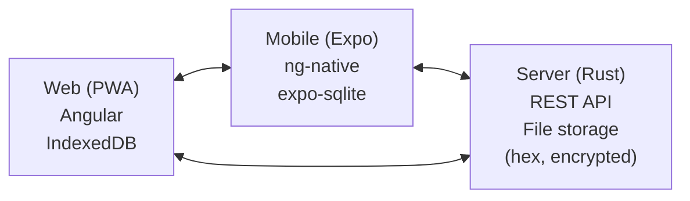

# vroooom 🚗

**Zero-knowledge** vehicle tracking application: fuel, maintenance, expenses, leasing.

The server can **never** read your data. Everything is encrypted client-side.

[](LICENSE)
[]()
[]()

---

## Features

- 🚗 **Vehicle management** : VIN, multi-fuel (hybrid, E85), mileage
- ⛽ **Fuel tracking** : fill-ups, real consumption (OBD vs calculated), price per liter
- 💰 **Expenses** : insurance, maintenance, tolls, parking, fines, credit/leasing
- 📊 **Statistics** : annual summary by category, cost per kilometer
- 🔄 **Multi-device sync** : web (PWA) + mobile (Android), local-first, offline
- 🌐 **Internationalization** : French and English UI, auto-detection, language switcher
- 🔒 **Zero-knowledge** : XChaCha20-Poly1305 encryption, Argon2id (21MB)
- 📁 **File storage** : no DB, backup via git, hex (text)

## Architecture



See [`docs/ARCHI.md`](docs/ARCHI.md) for details.

## Quick Start (Docker)

```bash
# Clone
mkdir -p ~/vroooom && cd ~/vroooom
git clone https://github.com/kuroidoruido/vroooom.git deploy
cd deploy

# Configure
cp .env.example .env
nano .env  # Edit DOMAIN, EMAIL

# SSL certificate
docker compose run --rm certbot certonly \
  --webroot --webroot-path=/var/www/certbot \
  -d api.vroooom.example.com --email admin@example.com --agree-tos

# Start
docker compose up -d
```

See [`docs/DEPLOYMENT.md`](docs/DEPLOYMENT.md) for all options (Docker Compose, plain Docker, native binary).

## Documentation

| Document | Description |
|----------|-------------|
| [`docs/MAIN.md`](docs/MAIN.md) | Project overview |
| [`docs/SECURITY.md`](docs/SECURITY.md) | Security mechanisms (zero-knowledge, crypto) |
| [`docs/DATA.md`](docs/DATA.md) | Data models and storage |
| [`docs/ARCHI.md`](docs/ARCHI.md) | Technical architecture |
| [`docs/BUSINESS.md`](docs/BUSINESS.md) | Business rules |
| [`docs/API.md`](docs/API.md) | REST API documentation |
| [`docs/DEPLOYMENT.md`](docs/DEPLOYMENT.md) | Deployment guide |
| [`docs/DEVELOPMENT.md`](docs/DEVELOPMENT.md) | Dev environment setup |
| [`docs/ROADMAP.md`](docs/ROADMAP.md) | Roadmap (MVP1, MVP2) |
| [`docs/FAQ.md`](docs/FAQ.md) | Frequently asked questions |
| [`docs/TESTING.md`](docs/TESTING.md) | Test strategy |
| [`docs/LEXICON.md`](docs/LEXICON.md) | Term definitions |

## Contributing

See [`CONTRIBUTING.md`](CONTRIBUTING.md). All contributions are welcome!

## License

[GPL v3](LICENSE) — Open source, self-hosting encouraged.

---

*Personal open-sourced project for the community.*
