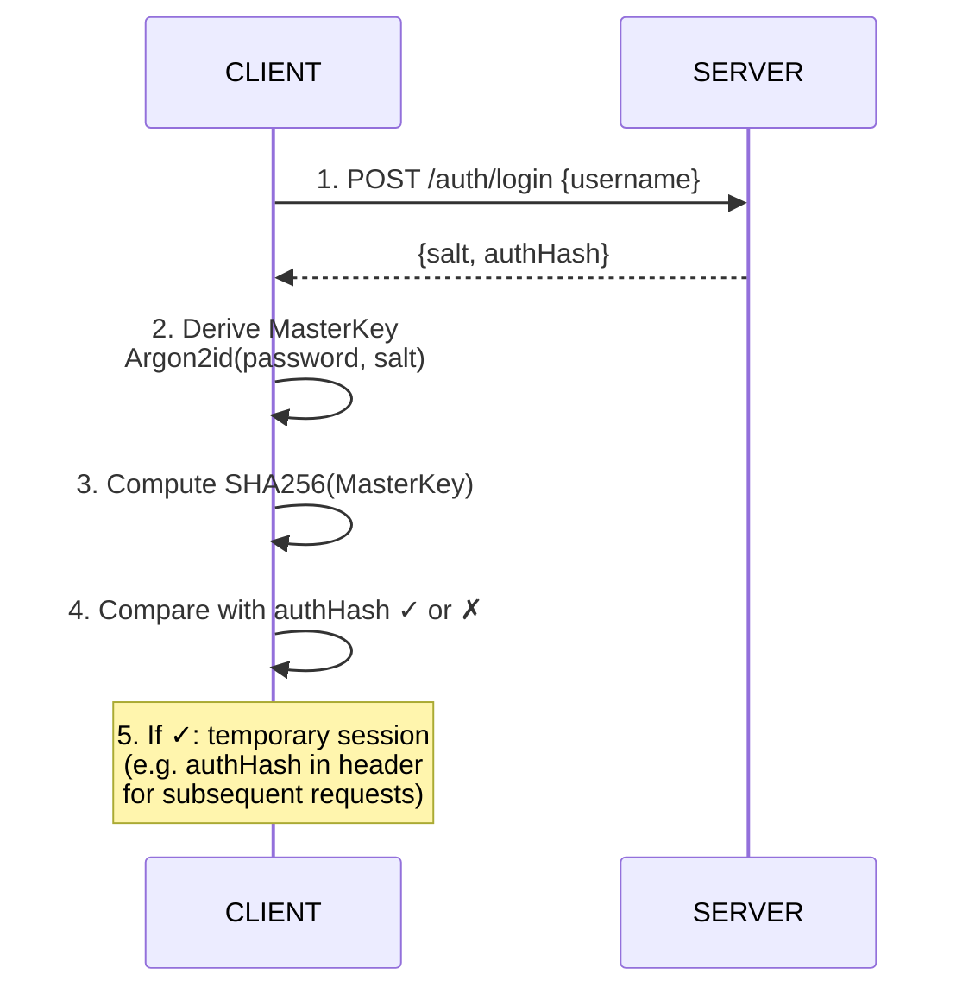

# REST API

## Table of contents

- [General principles](#general-principles)
- [Authentication](#authentication)
- [Auth endpoints](#auth-endpoints)
- [Data endpoints](#data-endpoints)
- [Sync endpoints](#sync-endpoints)
- [Error codes](#error-codes)
- [Examples](#examples)
- [Related documents](#related-documents)

---

## General principles

| Aspect | Value |
|--------|-------|
| **Base URL** | `https://api.vroooom.example.com` |
| **Format** | JSON (`application/json`) |
| **Blob encoding** | Hexadecimal (`0-9a-f` character strings) |
| **Authentication** | Zero-knowledge : the server verifies without knowing the password |
| **HTTPS** | Mandatory (TLS 1.3 recommended) |
| **CORS** | Restricted to `ALLOWED_ORIGINS` (see [DEPLOYMENT.md](DEPLOYMENT.md)) |

### Zero-knowledge invariant

> **The server does not know the content of the blobs.** It stores and serves them as opaque hexadecimal strings. It can neither decrypt them, nor modify them in an undetectable way (hash chain client-side).

### Exposed metadata

The server only knows :

| Metadata | Example | Sensitivity |
|----------|---------|-------------|
| User folder name | `SHA256(username)` | Opaque hash |
| `salt` | `a3f5...9c2d` (32 hex characters) | Public (not secret) |
| `authHash` | `b7e2...41af` (64 hex characters) | Irreversible hash of the MasterKey |
| Blob file names | `{expenseId}.enc` | Opaque hash chain |
| File `mtime` | `2026-10-09T14:32:00Z` | Modification timestamp (not the business date) |
| File size | `1234` (bytes) | Approximation of data volume |

**No business data** (amounts, mileage, VIN, brand, etc.) is ever transmitted in plaintext.

---

## Authentication

### Mechanism

Authentication is **zero-knowledge** : the server never receives the password, nor the MasterKey.



### Session

| Aspect | Implementation |
|--------|---------------|
| **Server storage** | None (stateless) or temporary in-memory token |
| **Required header** | `Authorization: Bearer {authHash}` or `X-Auth-Hash: {authHash}` |
| **Lifetime** | Until app close client-side (server can invalidate) |
| **Why this mechanism** | The server verifies that the user knows the password (via authHash) without ever possessing it. |

→ See [SECURITY.md — Login flow](SECURITY.md#login-flow)

---

## Auth endpoints

### `POST /api/auth/register`

Creates a new user account.

**Availability** : only if `FEATURE_ACCOUNT_CREATION=true` (see [DEPLOYMENT.md](DEPLOYMENT.md#environment-variables)).

#### Request

```json
POST /api/auth/register
Content-Type: application/json

{
  "username": "anthony",
  "salt": "a3f59c2d1b4e8f7a6d5c4b3a2918f0e7d",
  "authHash": "b7e241af9c3d8e2f1a4b5c6d7e8f9a0b1c2d3e4f5a6b7c8d9e0f1a2b3c4d5e6f"
}
```

| Field | Type | Description |
|-------|------|-------------|
| `username` | string | Username (unique). The server stores `SHA256(username)`. |
| `salt` | string (hex, 32 characters) | Argon2id salt, 16 bytes. Randomly generated client-side. |
| `authHash` | string (hex, 64 characters) | `SHA256(MasterKey)`, 32 bytes. Proof of knowledge without revealing the key. |

> **Note** : the password **never** transits. Only the salt and the derived key hash are sent.

#### Responses

| Code | Body | Description |
|------|------|-------------|
| `201` | `{"userId": "a3f5...9c2d"}` | Account created. `userId` = `SHA256(username)` hex. |
| `400` | `{"error": "invalid_request"}` | Missing or malformed fields (invalid hex, etc.). |
| `403` | `{"error": "feature_disabled"}` | `FEATURE_ACCOUNT_CREATION=false`. |
| `409` | `{"error": "username_exists"}` | This username is already registered. |
| `500` | `{"error": "internal_error"}` | Server error. |

---

### `POST /api/auth/login`

Retrieves authentication parameters for an existing username.

#### Request

```json
POST /api/auth/login
Content-Type: application/json

{
  "username": "anthony"
}
```

#### Responses

| Code | Body | Description |
|------|------|-------------|
| `200` | `{"salt": "a3f5...", "authHash": "b7e2..."}` | Verification parameters. The client derives the key and compares. |
| `400` | `{"error": "invalid_request"}` | Missing username. |
| `404` | `{"error": "user_not_found"}` | This username does not exist. |
| `500` | `{"error": "internal_error"}` | Server error. |

> **Note** : the server returns `salt` and `authHash` to allow client-side verification. Even if an attacker intercepts this response, they cannot derive the MasterKey without the password (Argon2id is expensive).

---

## Data endpoints

All Data endpoints require authentication (header `X-Auth-Hash` or equivalent).

### `GET /api/data`

Lists the metadata of all the user's blobs (not the content).

#### Request

```http
GET /api/data
X-Auth-Hash: b7e241af9c3d8e2f1a4b5c6d7e8f9a0b1c2d3e4f5a6b7c8d9e0f1a2b3c4d5e6f
```

#### Response

```json
200 OK
Content-Type: application/json

{
  "blobs": [
    {
      "id": "profile",
      "mtime": "2026-10-09T14:32:00Z",
      "size": 1234
    },
    {
      "id": "profile-events/b7e241af9c3d",
      "mtime": "2026-10-08T09:15:00Z",
      "size": 456
    },
    {
      "id": "expenses/veh_01H8/c9d477b3",
      "vehicleId": "veh_01H8",
      "mtime": "2026-10-09T14:32:00Z",
      "size": 789
    }
  ]
}
```

| Field | Type | Description |
|-------|------|-------------|
| `blobs` | array | List of blobs. |
| `blobs[].id` | string | Blob identifier (relative path, e.g. `profile`, `expenses/{vehicleId}/{expenseId}`). |
| `blobs[].vehicleId` | string? | Present only for expenses (parent folder). |
| `blobs[].mtime` | string (ISO 8601) | Last modification (filesystem). |
| `blobs[].size` | number | Size in bytes (of the hex content). |

---

### `GET /api/data/{blobId}`

Retrieves the encrypted content of a blob.

#### Request

```http
GET /api/data/expenses/veh_01H8/c9d477b3
X-Auth-Hash: b7e241af9c3d8e2f1a4b5c6d7e8f9a0b1c2d3e4f5a6b7c8d9e0f1a2b3c4d5e6f
```

#### Response

```json
200 OK
Content-Type: application/json

{
  "data": "a3f59c2d1b4e8f7a6d5c4b3a2918f0e7d..."
}
```

| Field | Type | Description |
|-------|------|-------------|
| `data` | string (hex) | Complete encrypted blob : `nonce[24] || ciphertext[N] || tag[16]`, hex-encoded. |

| Code | Description |
|------|-------------|
| `200` | Blob found. |
| `401` | Not authenticated (invalid authHash). |
| `404` | Blob does not exist. |

---

### `PUT /api/data/{blobId}`

Creates or updates an encrypted blob. **Optimistic locking** via `expectedParentId`.

#### Request

```json
PUT /api/data/expenses/veh_01H8/c9d477b3
Content-Type: application/json
X-Auth-Hash: b7e241af9c3d8e2f1a4b5c6d7e8f9a0b1c2d3e4f5a6b7c8d9e0f1a2b3c4d5e6f

{
  "data": "a3f59c2d1b4e8f7a6d5c4b3a2918f0e7d...",
  "expectedParentId": "b7e241af9c3d8e2f1a4b5c6d7e8f9a0b1c2d3e4f5a6b7c8d9e0f1a2b3c4d5e6f"
}
```

| Field | Type | Required | Description |
|-------|------|----------|-------------|
| `data` | string (hex) | ✅ | Complete encrypted blob. |
| `expectedParentId` | string (hex) | ❌ | Expected parent ID (hash chain). If the server parent differs → `409`. |

#### Responses

| Code | Description |
|------|-------------|
| `201` | Blob created/updated. |
| `400` | `data` missing or invalid hex. |
| `401` | Not authenticated. |
| `409` | **Conflict** : `expectedParentId` does not match the current parent on the server. |
| `500` | Server error. |

---

### `DELETE /api/data/{blobId}`

Deletes a blob server-side.

> **Note** : client-side, deletion is a **soft delete** (tombstone). The client first sends the tombstone via `PUT`, then can call `DELETE` to clean up the original file.

#### Request

```http
DELETE /api/data/expenses/veh_01H8/c9d477b3
X-Auth-Hash: b7e241af9c3d8e2f1a4b5c6d7e8f9a0b1c2d3e4f5a6b7c8d9e0f1a2b3c4d5e6f
```

#### Response

| Code | Description |
|------|-------------|
| `204` | Blob deleted (no body). |
| `401` | Not authenticated. |
| `404` | Blob does not exist. |

---

## Sync endpoints

### `GET /api/sync`

Lists the IDs modified since a given mtime (incremental sync).

#### Request

```http
GET /api/sync?vehicleId=veh_01H8&since=2026-10-08T00:00:00Z
X-Auth-Hash: b7e241af9c3d8e2f1a4b5c6d7e8f9a0b1c2d3e4f5a6b7c8d9e0f1a2b3c4d5e6f
```

| Parameter | Type | Required | Description |
|-----------|------|----------|-------------|
| `vehicleId` | string | ❌ | Filter by vehicle. If omitted, all vehicles. |
| `since` | string (ISO 8601) | ❌ | Only returns blobs modified after this date. |

#### Response

```json
200 OK
Content-Type: application/json

{
  "expenses": [
    { "id": "c9d477b3", "mtime": "2026-10-09T14:32:00Z" },
    { "id": "d8e366a2", "mtime": "2026-10-09T10:15:00Z" }
  ],
  "profileEvents": [
    { "id": "b7e241af", "mtime": "2026-10-08T09:15:00Z" }
  ]
}
```

| Field | Type | Description |
|-------|------|-------------|
| `expenses` | array | Modified expenses. |
| `expenses[].id` | string | Expense ID (hash chain). |
| `expenses[].mtime` | string | Last modification. |
| `profileEvents` | array | Modified profile events. |
| `profileEvents[].id` | string | Event ID. |
| `profileEvents[].mtime` | string | Last modification. |

---

## Error codes

| Code | Meaning | When |
|------|---------|------|
| `400` | Bad Request | Invalid JSON body, missing fields, malformed hex. |
| `401` | Unauthorized | `authHash` missing or invalid (user not recognized). |
| `403` | Forbidden | Forbidden action (e.g. `FEATURE_ACCOUNT_CREATION=false` for register). |
| `404` | Not Found | Blob or user does not exist. |
| `409` | Conflict | Detected conflict (username exists, or `expectedParentId` does not match). |
| `500` | Internal Server Error | Unexpected server error. |

### Error format

```json
{
  "error": "error_code",
  "message": "Human-readable description (English, for logs)"
}
```

---

## Examples

### Complete scenario : account creation + first fill-up

```bash
# 1. Register (client-side, the password is never sent)
curl -X POST https://api.vroooom.example.com/api/auth/register \
  -H "Content-Type: application/json" \
  -d '{
    "username": "anthony",
    "salt": "a3f59c2d1b4e8f7a6d5c4b3a2918f0e7d",
    "authHash": "b7e241af9c3d8e2f1a4b5c6d7e8f9a0b1c2d3e4f5a6b7c8d9e0f1a2b3c4d5e6f"
  }'
# → 201 {"userId": "..."}

# 2. Login (retrieve salt + authHash)
curl -X POST https://api.vroooom.example.com/api/auth/login \
  -H "Content-Type: application/json" \
  -d '{"username": "anthony"}'
# → 200 {"salt": "...", "authHash": "..."}

# 3. Upload the first blob (encrypted fill-up)
curl -X PUT https://api.vroooom.example.com/api/data/expenses/veh_01H8/c9d477b3 \
  -H "Content-Type: application/json" \
  -H "X-Auth-Hash: b7e241af9c3d8e2f1a4b5c6d7e8f9a0b1c2d3e4f5a6b7c8d9e0f1a2b3c4d5e6f" \
  -d '{
    "data": "a3f59c2d1b4e8f7a6d5c4b3a2918f0e7d...",
    "expectedParentId": null
  }'
# → 201 Created

# 4. Incremental sync (retrieve modifications)
curl -X GET "https://api.vroooom.example.com/api/sync?since=2026-10-08T00:00:00Z" \
  -H "X-Auth-Hash: b7e241af9c3d8e2f1a4b5c6d7e8f9a0b1c2d3e4f5a6b7c8d9e0f1a2b3c4d5e6f"
# → 200 {"expenses": [...], "profileEvents": [...]}
```

---

## Related documents

- [MAIN.md](MAIN.md) — Overview
- [SECURITY.md](SECURITY.md) — Zero-knowledge authentication, encryption
- [DATA.md](DATA.md) — Blob formats, hash chain, sync
- [ARCHI.md](ARCHI.md) — Server architecture (Rust, stateless)
- [DEPLOYMENT.md](DEPLOYMENT.md) — Environment variables (`FEATURE_ACCOUNT_CREATION`)
- [BUSINESS.md](BUSINESS.md) — Business rules (expense types)
- [LEXICON.md](LEXICON.md) — Definitions (Blob, Hash chain, Zero-knowledge)

---

*Last updated : 2026-10-09*
