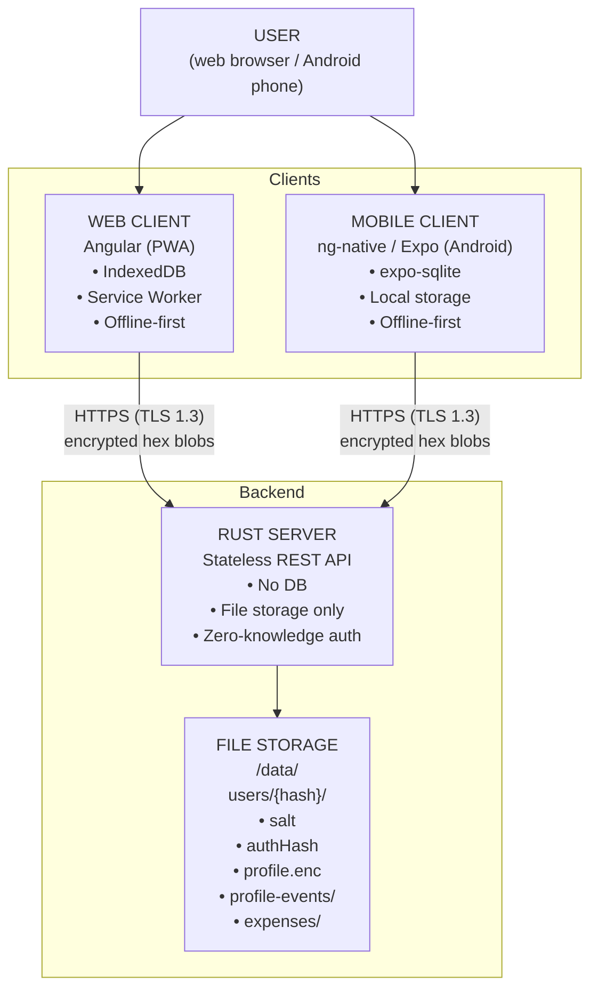
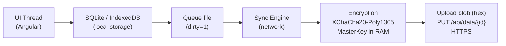
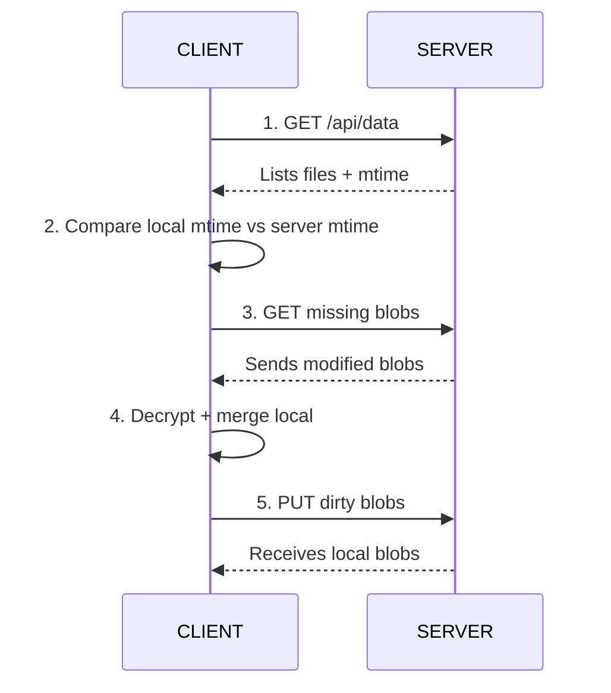
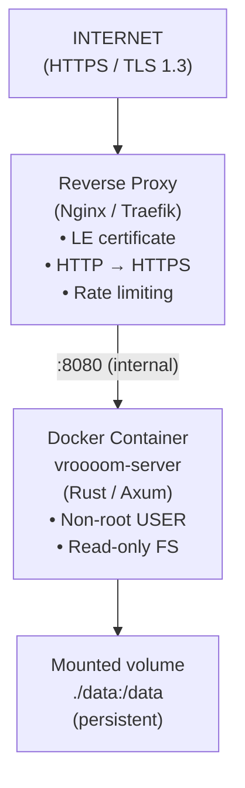
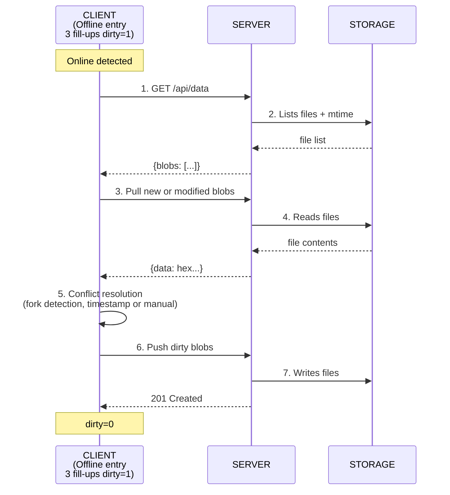
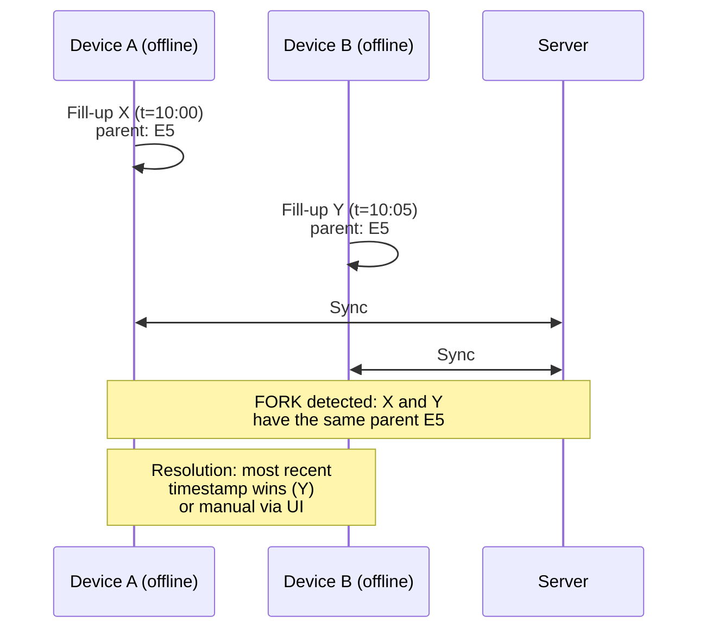

# Technical architecture

## Table of contents

- [Overview](#overview)
- [Detailed components](#detailed-components)
- [Data flows](#data-flows)
- [Architectural choices](#architectural-choices)
- [Storage schema](#storage-schema)
- [Deployment](#deployment)
- [Sync diagram](#sync-diagram)
- [Related documents](#related-documents)

---

## Overview



**Invariant** : the Rust server never decrypts anything. It stores and serves opaque hex blobs.

---

## Detailed components

### Web client (Angular PWA)

| Aspect | Technology | Why |
|--------|------------|-----|
| Framework | Angular | Mature ecosystem, native TypeScript, DI, routing |
| Local storage | IndexedDB (via Dexie.js or custom layer) | Structured queries, transactions, offline performance |
| Offline | Service Worker (Workbox or Angular SW) | 100% offline operation, asset caching |
| Encryption | libsodium.js (WASM) | XChaCha20-Poly1305 + Argon2id in the browser |
| PWA | Manifest + icons | Home screen installation, standalone mode |

**Why IndexedDB and not localStorage** : localStorage is synchronous, limited to ~5 MB, without indexes. IndexedDB is asynchronous, transactional, unlimited (browser quota), indexable.

### Mobile client (ng-native / Expo)

| Aspect | Technology | Why |
|--------|------------|-----|
| Framework | ng-native (Angular + Expo) | Same language/stack as web, business code sharing |
| Local storage | expo-sqlite | Native SQLite, same logical schema as web IndexedDB |
| MVP1 platform | Android only | iOS in "Future" (see [ROADMAP.md](ROADMAP.md)) |
| Distribution | APK / Google Play | MVP1 : direct APK, Play Store in MVP2 |

**Why ng-native** : shares 80%+ of business code (services, models, calculations) between web and mobile. No need to learn Swift/Kotlin. ng-native allows testing a new technology (Angular + Expo) with contained risk.

### Rust server

| Aspect | Technology | Why |
|--------|------------|-----|
| HTTP framework | Axum (or Actix-web) | Async, performance, mature Tokio ecosystem |
| Storage | std::fs (files only) | No DB, no heavy dependency |
| Auth | Client-side verification (authHash) | Zero-knowledge, the server doesn't know who is who |
| Concurrency | Tokio (async/await) | High concurrency, low memory footprint |

**Why Rust** :
- **Memory safety** : no buffer overflow, no use-after-free (except explicit `unsafe`)
- **Performance** : lightweight binary (~5-10 MB), instant startup, low RAM consumption
- **Mature async ecosystem** : Tokio is the de facto standard for async in Rust

---

## Data flows

### Local-first : offline creation



**Rule** : the UI never blocks on the network. Any operation is local first, synchronized afterwards.

### Pull/push synchronization



---

## Architectural choices

### Why no DB

| Criterion | Without DB (files) | With DB (PostgreSQL/SQLite) |
|-----------|-------------------|------------------------------|
| Backup | `git add /data && git commit` | SQL dump, specific tools |
| Deployment | Copy a folder | Schema migration, versioning |
| Dependency | None | DBMS binary, config, tuning |
| Attack surface | Files only | SQL injection, exposed DB ports |
| Readability | `cat`, `grep`, `diff` | SQL queries |
| Incremental sync | Native file mtime | Trigger, `updated_at` column |

**Decision** : file storage. The server is a **dumb encrypted file server**. All business complexity is client-side.

### Why Rust for the server

| Criterion | Rust | Node.js | Python |
|-----------|------|---------|--------|
| Performance | ⭐⭐⭐ | ⭐⭐ | ⭐ |
| Memory safety | ⭐⭐⭐ (ownership) | ⭐⭐ (GC) | ⭐⭐ (GC) |
| RAM footprint | ~5-10 MB | ~50-100 MB | ~30-50 MB |
| Startup | Instant | ~100ms | ~200ms |
| Async ecosystem | Tokio (mature) | Native (mature) | asyncio (less mature) |
| Deployment | Single binary | Node + deps | Python + deps |

**Decision** : Rust. A static binary, no runtime, no dependency manager in prod.

### Why unified Angular (web + ng-native)

| Criterion | Angular alone (web + native mobile) | Unified Angular (web + ng-native) |
|-----------|-------------------------------------|-----------------------------------|
| Language | TS + Swift/Kotlin | TypeScript only |
| Business code sharing | ~30% (API clients) | ~80% (services, models, calculations) |
| Skills required | 2 stacks | 1 stack |
| Maintenance | 2 codebases | 1 business codebase |
| Mobile performance | Native (optimal) | WebView/Expo (sufficient for this case) |

**Decision** : unified Angular. Vehicle tracking is not a 3D game, WebView/Expo performance is more than sufficient. The productivity gain (one team, one business codebase) takes priority.

**Why ng-native specifically** : allows testing a new technology (Angular + Expo) with contained risk. If ng-native fails, migration to React Native or Flutter remains possible (business code is isolated).

### Why hex storage

| Criterion | Hexadecimal | Binary |
|-----------|-------------|--------|
| Git compatibility | ✅ Pure text, line-by-line diff | ❌ Binary files, unreadable diff |
| Backup | `git clone`, `rsync`, `scp` | Specific tools |
| Debug | `cat`, `grep`, `wc -c` | `xxd`, `hexdump` |
| Size | 2× binary size | Reference |
| Corruption | Visually detectable (non-hex characters) | Checksum required |

**Decision** : hexadecimal. The 2× overhead is negligible (blobs of a few KB). Backup simplicity and git readability take priority.

→ See [SECURITY.md — Storage format](SECURITY.md#hexadecimal-storage-format)

### Why event sourcing for Profile

| Approach | Advantage | Disadvantage |
|----------|-----------|--------------|
| Snapshot only (`profile.enc` overwritten) | Simple, fast | No history, conflicts hard to resolve |
| Event sourcing (`profile-events/*.enc`) | Complete history, unified conflicts, audit | Event replay (mitigated by snapshot) |

**Decision** : event sourcing + snapshot. The snapshot avoids replaying all events on every load. Events enable conflict resolution and audit.

→ See [DATA.md — Event sourcing](DATA.md#event-sourcing-profile)

### Why GPL v3

| Criterion | GPL v3 | MIT / Apache |
|-----------|--------|--------------|
| Open source | ✅ | ✅ |
| Self-hosting encouraged | ✅ (copyleft) | ✅ |
| Protection against closed resale | ✅ (obligation to share modifications) | ❌ |
| Transparency for security | ✅ (mandatory public audit) | ✅ |
| Ecosystem compatibility | ⚠️ (less permissive) | ✅ |

**Decision** : GPL v3. For a zero-knowledge application, transparency is essential. Copyleft guarantees that any modified version (even hosted) remains open source, protecting users.

---

## Storage schema

```
/data/                                    # Docker mount (persistent)
└── users/
    └── {SHA256(username)}/               # Folder name = hash of username
        ├── salt                          # 16 bytes, hex (KDF salt, plaintext)
        ├── authHash                      # 32 bytes, hex (SHA256(MasterKey))
        ├── profile.enc                   # Encrypted Profile snapshot
        ├── profile-events/
        │   ├── {eventId_1}.enc           # Event 1 (vehicle_added, etc.)
        │   ├── {eventId_2}.enc
        │   └── ...
        └── expenses/
            ├── {vehicleId_1}/
            │   ├── {expenseId_1}.enc     # 1 file per expense
            │   ├── {expenseId_2}.enc
            │   └── ...
            ├── {vehicleId_2}/
            │   └── ...
            └── ...
```

| Element | Format | Server visibility |
|---------|--------|-------------------|
| User folder | `SHA256(username)` hex | Opaque hash (not the username) |
| `salt` | 16 bytes hex | Plaintext (not secret) |
| `authHash` | 32 bytes hex | Plaintext (irreversible hash) |
| `profile.enc` | Encrypted hex blob | Opaque |
| `profile-events/*.enc` | Encrypted hex blobs | Opaque |
| `expenses/*/*.enc` | Encrypted hex blobs | Opaque |
| File mtime | Filesystem timestamp | Plaintext (sync metadata) |

**Why this structure** :
- `username_hash` : the server does not store the username in plaintext (sensitive metadata)
- `profile.enc` : fast loading without replaying all events
- `profile-events/` : event sourcing, unified conflict resolution
- `expenses/{vehicleId}/` : per-vehicle granularity for incremental sync
- 1 file per expense : only modified files are transferred

→ See [DATA.md — Server storage](DATA.md#server-storage)

---

## Deployment



| Aspect | Choice | Why |
|--------|--------|-----|
| Containerization | Docker | Reproducibility, isolation, simplified deployment |
| Reverse proxy | Nginx or Traefik | HTTPS mandatory, automatic Let's Encrypt certificates (Traefik) |
| Volume | `./data:/data` | Blob persistence, facilitated external backup |
| User | Non-root in the container | Principle of least privilege |
| Exposure | Port 8080 internal only | The proxy is the only entry point |

→ See [DEPLOYMENT.md](DEPLOYMENT.md) for the complete guide

---

## Sync diagram

### Complete sequence (offline → online)



### Conflict detection



→ See [DATA.md — Conflicts](DATA.md#conflict-detection-and-resolution)

---

## Related documents

- [MAIN.md](MAIN.md) — Project overview
- [SECURITY.md](SECURITY.md) — Encryption, security flows, KDF
- [DATA.md](DATA.md) — Data models, storage, sync, conflicts
- [API.md](API.md) — REST API contract (detailed endpoints)
- [BUSINESS.md](BUSINESS.md) — Business rules
- [DEPLOYMENT.md](DEPLOYMENT.md) — Docker deployment guide
- [ROADMAP.md](ROADMAP.md) — Roadmap
- [LEXICON.md](LEXICON.md) — Definitions (Local-first, ng-native, Zero-knowledge)

---

*Last updated : 2026-10-09*
