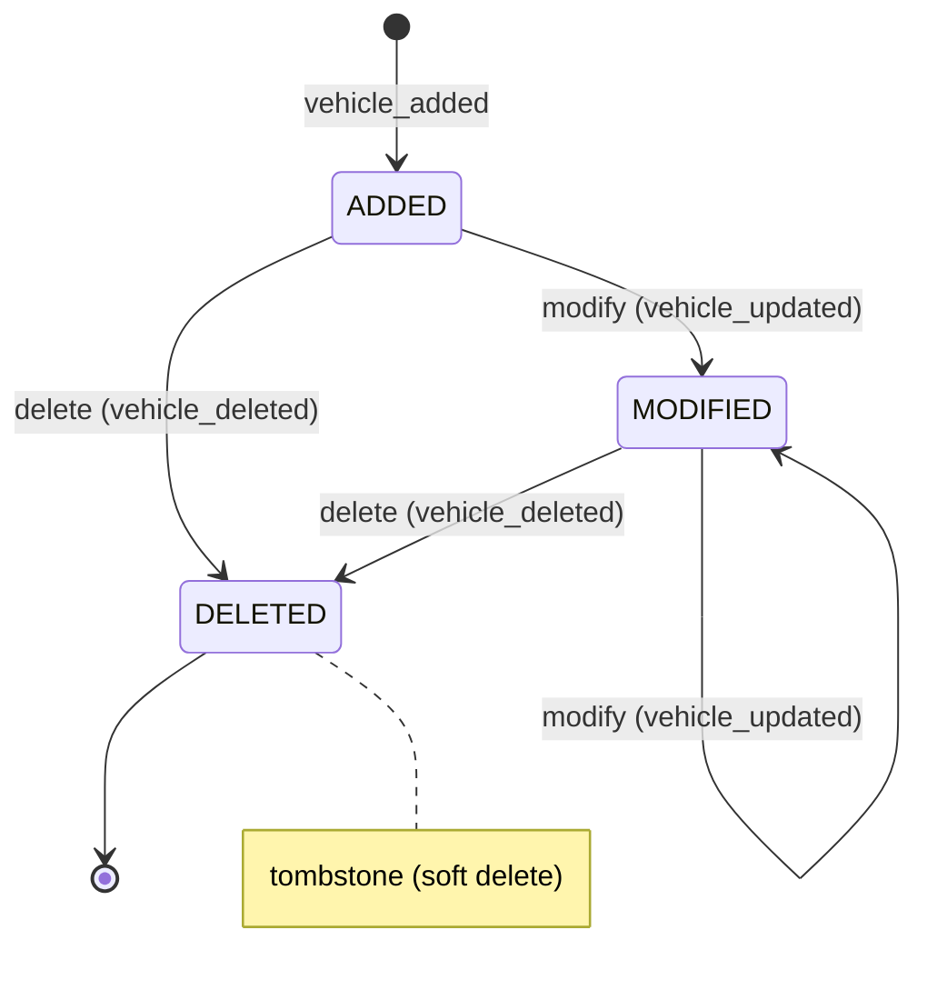

# Business rules

## Table of contents

- [Vehicle management](#vehicle-management)
- [Fill-up management](#fill-up-management)
- [Expense management](#expense-management)
- [Insurance rule](#insurance-rule)
- [Business calculations](#business-calculations)
- [States and transitions](#states-and-transitions)
- ["Raw events" view](#raw-events-view)
- [MVP1 vs MVP2](#mvp1-vs-mvp2)
- [Related documents](#related-documents)

---

## Vehicle management

### Required fields

| Field | Type | Required | Why |
|-------|------|----------|-----|
| `brand` | string | ✅ | Immediate visual identification |
| `model` | string | ✅ | Differentiate two vehicles of the same brand |
| `year` | number | ✅ | Vehicle age calculation, maintenance reminders |
| `fuelTypes` | array | ✅ | Pre-fill fuel type during a fill-up |
| `vin` | string | ❌ | Optional but recommended (uniqueness, manufacturer recalls) |
| `firstRegistrationDate` | ISO 8601 | ❌ | Precise age calculation, inspection |
| `purchaseDate` | ISO 8601 | ❌ | Total cost of ownership calculation |
| `initialMileage` | number | ❌ | Reference for distance traveled |

### Multi-fuel

A vehicle can support multiple fuel types. Real cases :

| Configuration | `fuelTypes` | Explanation |
|---------------|-------------|-------------|
| Regular gasoline | `['essence']` | Standard case |
| Diesel | `['diesel']` | Standard case |
| Plug-in hybrid | `['essence', 'electric']` | Two "tanks" : gasoline + battery. The user chooses the type during fill-up/charge. |
| Bio-ethanol kit | `['essence', 'e85']` | Same tank, fuel of choice (E85 or SP95/SP98). |
| Non-plug-in hybrid | `['essence']` | The battery is not user-rechargeable, only gasoline matters. |
| Electric | `['electric']` | 100% electric, unit kWh instead of liters. |
| LPG | `['lpg']` | Additional LPG tank or conversion. |

**Why multi-fuel** : modern vehicles (plug-in hybrids, E85 flex-fuel) are common. Forcing a single fuel type would exclude these legitimate use cases.

→ See [DATA.md — Vehicle](DATA.md#vehicle)

---

## Fill-up management

### Rules

| Rule | Detail | Why |
|------|--------|-----|
| **Partial fill-up by default** | `isFull: false` by default | Real case : you almost never recharge from 0. A full tank is the exception (long trip, highway). |
| **Fuel type pre-filled** | From `vehicle.fuelTypes`. If only one type → auto. If several → mandatory choice. | Avoids entry errors, speeds up entry. |
| **Price per liter calculated** | `pricePerLiter = round(amount / liters * 100)` (cents) | The price displayed at the pump is often rounded ; calculating it avoids inconsistencies. The user can correct it. |
| **Mileage mandatory** | `mileage` required | Without mileage, impossible to calculate consumption between two fill-ups. |
| **OBD consumption vs calculated** | `odbConsumption` (optional, entered) vs `calculatedConsumption` (auto) | The OBD gives an instantaneous/estimated value. The app calculation (real liters/km) is ground truth. Comparing them detects anomalies (leak, entry error). |

### Entering a fill-up

```typescript
// Example : partial gasoline fill-up
{
  kind: 'fuel',
  fuelType: 'essence',
  isFull: false,              // Partial (default)
  liters: 32.5,
  amount: 5850,               // 58.50 EUR in cents
  pricePerLiter: 180,         // 1.80 EUR/L (calculated : 5850 / 32.5 ≈ 180)
  mileage: 45230,
  date: '2026-10-09T14:30:00Z',
  currency: 'EUR',
  odbConsumption: 6.2,        // Optional, read from the OBD
  // calculatedConsumption will be calculated at display time
}
```

---

## Expense management

### Fixed categories

| Category | `kind` | Specific fields | Why this category |
|----------|--------|-----------------|-------------------|
| Fuel | `fuel` | `fuelType`, `isFull`, `liters`, `mileage` | Expense item #1 for a combustion vehicle |
| Insurance | `insurance` | `periodStart`, `periodEnd`, `provider` | Annual/monthly contract, tacitly renewed |
| Maintenance | `maintenance` | `mileage`, `description` | Oil change, tires, repairs, servicing |
| Toll | `toll` | `location` | Recurring cost on highways |
| Parking | `parking` | `location`, `durationHours` | Recurring urban cost |
| Fine | `fine` | `reason`, `pointsLost` | Infractions management (license points) |
| Wash | `wash` | `washType` | Regular maintenance cost |
| Car loan | `credit` | `description` | Reimbursement (claim, overpayment) |
| Leasing | `leasing` | `month`, `contractMileage` | Monthly rent in LLD/LOA |
| Tax | `tax` | `taxType` | Registration card, ecological penalty, etc. |

**Why these fixed categories** : the annual summary by category only makes sense if categories are stable and exhaustive. A catch-all "Other" category would make the annual summary unreadable.

→ See [DATA.md — Expense ADT](DATA.md#expense-adt)

---

## Insurance rule

### Principle

The **current insurance is NOT a field of the vehicle**. It is **derived from expenses** :

```
currentInsurance = latest expense of kind 'insurance'
                   with periodEnd > today's date
                   for this vehicle
```

### Why this rule

| Problem if insurance stored in Vehicle | Solution with derivation |
|----------------------------------------|--------------------------|
| Change of insurer → overwriting the old value | The history is kept in the expenses (event sourcing) |
| Impossible to know which insurance covered at a given date | Each expense has `periodStart`/`periodEnd`, the history can be reconstructed |
| Double source of truth (Vehicle.insurance vs Expense) | Single source : the expenses |

### Example

```typescript
// January 2026 : contract A
{ kind: 'insurance', amount: 45000, periodStart: '2026-01-01', periodEnd: '2026-12-31', provider: 'MAIF' }

// July 2026 : change to contract B (cheaper)
{ kind: 'insurance', amount: 38000, periodStart: '2026-07-01', periodEnd: '2027-06-30', provider: 'Lemonade' }

// On October 15, 2026 :
// → currentInsurance = contract B (periodEnd 2027-06-30 > 2026-10-15)
// → complete history available : contract A (January-June), contract B (July+)
```

---

## Business calculations

### Average consumption (L/100km)

Calculated **only between two full fill-ups** (`isFull: true`) :

```
consumption = (sum of liters between the two full fill-ups)
              / (lastKm - firstKm) * 100
```

| Rule | Justification |
|------|---------------|
| Only full fill-ups | A partial fill-up skews the calculation (we don't know the exact quantity in the tank). |
| Sum of liters between the two fill-ups | Includes intermediate partial fill-ups. |
| Denominator = mileage difference | The odometer reading is the truth. |

**Example** :

```
Fill-up 1 (full) : km 40000, tank full
Fill-up 2 (partial) : 30L, km 40300
Fill-up 3 (partial) : 25L, km 40550
Fill-up 4 (full) : km 40800, tank full → 55L added (30+25)

Consumption = 55 / (40800 - 40000) * 100 = 6.875 L/100km
```

### Cost per kilometer

```
costKm = totalExpenses / (currentKm - initialKm)
```

Includes **all** expenses (fuel, maintenance, insurance, tolls, etc.) to reflect the real cost of ownership.

### Annual summary

| Aggregate | Calculation |
|-----------|-------------|
| Total expenses | Sum of `amount` over the year, by category |
| Total fuel | Sum of `amount` of `fuel` expenses |
| Average consumption | See calculation above, over the year |
| Cost per 100 km | `totalExpenses / kmTraveled * 100` |
| Km traveled | `max(mileage) - min(mileage)` over the year's expenses |

---

## States and transitions

### Vehicle states



### Allowed transitions

| Event | Precondition | Effect |
|-------|-------------|--------|
| `vehicle_added` | None | Vehicle creation in the profile |
| `vehicle_updated` | Vehicle exists | Field update (brand, model, initial km, etc.) |
| `vehicle_deleted` | Vehicle exists | Soft delete (tombstone in profile-events) |
| `expense_added` | Vehicle exists | New expense, chained to the previous one |
| `expense_deleted` | Expense exists | Tombstone (`kind: 'delete'`, `targetId`) |
| `mileage_updated` | — | Update of the current mileage (stored in the last expense or a dedicated event) |

**Why explicit events** : event sourcing guarantees the audit trail. Each change is traced, timestamped, chained (hash).

→ See [DATA.md — Event sourcing](DATA.md#event-sourcing-profile)

---

## "Raw events" view

### Principle

A dedicated page displays the **timeline of all events** (profile + expenses), in chronological order :

| Date | Event | Details |
|------|-------|---------|
| 2026-10-09 14:32 | `expense_added` | Fill-up 45L, 72.50€ |
| 2026-10-08 09:15 | `vehicle_added` | Renault Clio V |
| 2026-10-01 18:00 | `expense_added` | Insurance 450€ |
| 2026-09-15 11:20 | `expense_deleted` | Toll A6 (duplicate) |
| 2026-09-10 08:00 | `preference_changed` | Currency → EUR |

### Why this view

| Need | Solution |
|------|----------|
| **Trust** | The user sees that their data is properly saved, timestamped, chained. |
| **Debug** | In case of a sync conflict, the user understands what happened. |
| **Transparency** | The user can verify that no event has been lost or altered (hash chain). |
| **Audit** | Proof in case of dispute (e.g. fine amount, fill-up date). |

---

## MVP1 vs MVP2

| Feature | MVP1 | MVP2 | Why this split |
|---------|------|------|----------------|
| Vehicle CRUD | ✅ Complete | — | Core of the application, essential |
| Fill-ups (fuel) | ✅ | — | Use case #1 |
| Multi-fuel | ✅ Basic | ✅ Advanced (separate tanks) | MVP1 : type selection. MVP2 : separate gasoline/electric tracking. |
| Expenses (all categories) | ✅ | — | Necessary for the annual summary |
| Annual summary | ✅ | — | Main value for the user |
| Leasing | ✅ Manual entry | ✅ Monthly payment tracking, allowed km, alerts | MVP2 : complex business logic (contract, overage) |
| Maintenance | ✅ Free entry | ✅ Reminders, documents, photos | MVP2 : requires configurable reminder rules |
| PDF export | ❌ | ✅ | MVP2 : advanced formatting |
| Charts | ❌ | ✅ | MVP2 : trend visualization |
| Multi-device sync | ✅ | — | Fundamental for local-first |
| Conflicts | ✅ Manual resolution | ✅ Auto (timestamp) | MVP1 : manual is enough. MVP2 : auto for UX. |
| About page | ✅ | — | GPL license, transparency |

→ See [ROADMAP.md](ROADMAP.md) for the complete detail

---

## Related documents

- [MAIN.md](MAIN.md) — Project overview
- [DATA.md](DATA.md) — Data models (Expense, Vehicle, Profile)
- [SECURITY.md](SECURITY.md) — Business data encryption
- [ARCHI.md](ARCHI.md) — Technical architecture
- [API.md](API.md) — Synchronization endpoints
- [ROADMAP.md](ROADMAP.md) — Product roadmap
- [LEXICON.md](LEXICON.md) — Definitions (ADT, Event sourcing, Tombstone)

---

*Last updated : 2026-10-09*
