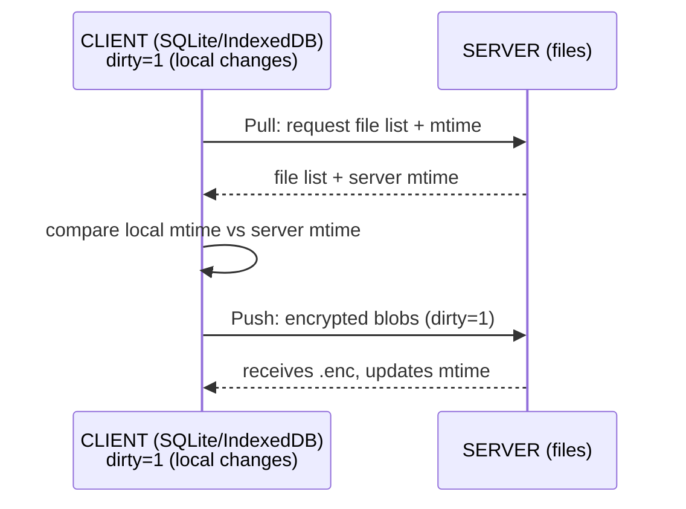
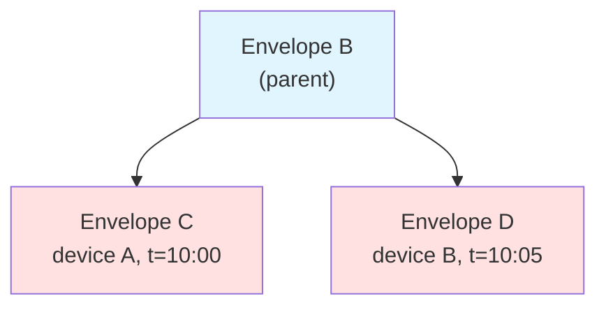
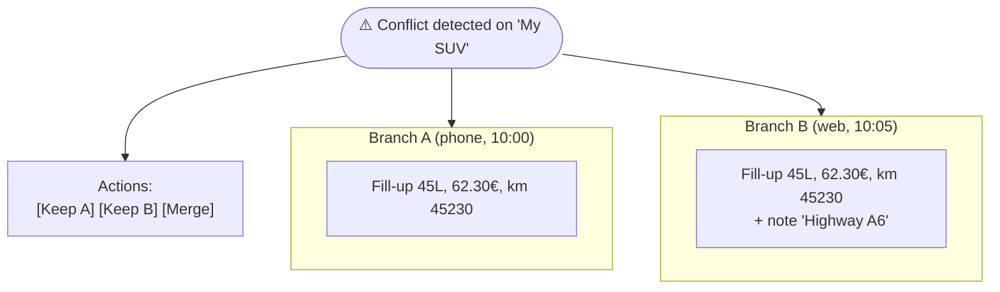

# Data — Models and storage

## Table of contents

- [TypeScript models](#typescript-models)
- [Server storage](#server-storage)
- [Local storage](#local-storage)
- [Hash chaining](#hash-chaining)
- [Event sourcing (Profile)](#event-sourcing-profile)
- [Soft delete (tombstone)](#soft-delete-tombstone)
- [Naming strategy](#naming-strategy)
- [Synchronization](#synchronization)
- [Conflict detection and resolution](#conflict-detection-and-resolution)
- [Related documents](#related-documents)

---

## TypeScript models

### Expense (ADT)

```typescript
type ExpenseKind =
  | 'fuel'        // Fuel fill-up / charge
  | 'insurance'   // Insurance
  | 'maintenance' // Maintenance (oil change, tires, repairs)
  | 'toll'        // Toll
  | 'parking'     // Parking
  | 'fine'        // Fine
  | 'wash'        // Wash
  | 'credit'      // Car loan (repayment)
  | 'leasing'     // Leasing rent
  | 'tax'         // Tax (registration card, etc.)
  | 'delete';     // Tombstone (soft delete)

interface ExpenseBase {
  kind: ExpenseKind;
  amount: number;       // Amount in cents (avoids floats)
  currency: string;     // ISO 4217, e.g. "EUR"
  date: string;         // ISO 8601
  note?: string;
}

interface FuelExpense extends ExpenseBase {
  kind: 'fuel';
  fuelType: 'essence' | 'diesel' | 'e85' | 'electric' | 'lpg' | 'hybrid';
  isFull: boolean;              // true = full, false = partial
  liters: number;               // Liters (or kWh for electric)
  pricePerLiter: number;        // Unit price in cents
  mileage: number;              // Odometer reading
  odbConsumption?: number;      // OBD consumption (L/100km or kWh/100km)
  calculatedConsumption?: number; // Consumption calculated by the app
}

interface InsuranceExpense extends ExpenseBase {
  kind: 'insurance';
  periodStart: string;  // Coverage start
  periodEnd: string;    // Coverage end
  provider?: string;    // Insurance company
}

interface MaintenanceExpense extends ExpenseBase {
  kind: 'maintenance';
  mileage: number;
  description: string;  // "Oil change 5W30", "Winter tires", etc.
}

interface TollExpense extends ExpenseBase {
  kind: 'toll';
  location?: string;
}

interface ParkingExpense extends ExpenseBase {
  kind: 'parking';
  location?: string;
  durationHours?: number;
}

interface FineExpense extends ExpenseBase {
  kind: 'fine';
  reason?: string;
  pointsLost?: number;  // Points lost (France)
}

interface WashExpense extends ExpenseBase {
  kind: 'wash';
  washType?: 'exterior' | 'interior' | 'full';
}

interface CreditExpense extends ExpenseBase {
  kind: 'credit';
  description: string;  // "Claim reimbursement", etc.
}

interface LeasingExpense extends ExpenseBase {
  kind: 'leasing';
  month: string;        // "2026-01"
  contractMileage?: number; // Contractual monthly mileage
}

interface TaxExpense extends ExpenseBase {
  kind: 'tax';
  taxType: 'registration' | 'other';
}

interface DeleteTombstone extends ExpenseBase {
  kind: 'delete';
  targetId: string;     // ID of the deleted expense
}

type Expense =
  | FuelExpense
  | InsuranceExpense
  | MaintenanceExpense
  | TollExpense
  | ParkingExpense
  | FineExpense
  | WashExpense
  | CreditExpense
  | LeasingExpense
  | TaxExpense
  | DeleteTombstone;
```

**Why an ADT (union type) rather than a table with nullable columns** : compile-time type-safety, impossibility of invalid states (e.g. `fuel` without `liters`), exhaustiveness checking in `switch`.

### ExpenseEnvelope

```typescript
interface ExpenseEnvelope {
  id: string;         // Hash chain (see dedicated section)
  vehicleId: string;  // Reference to the vehicle
  parentId: string | null; // Hash of the parent envelope (chaining)
  timestamp: string;  // ISO 8601, creation/modification time
  data: Expense;      // The expense itself
}
```

### Vehicle

```typescript
interface Vehicle {
  vin?: string;              // Serial number (VIN)
  brand: string;             // Brand
  model: string;             // Model
  year: number;              // Manufacturing year
  firstRegistrationDate?: string; // First registration date (ISO 8601)
  purchaseDate?: string;     // Purchase date
  initialMileage?: number;   // Mileage at purchase
  fuelTypes: Array<'essence' | 'diesel' | 'e85' | 'electric' | 'lpg' | 'hybrid'>;
  // Note : insurance is NOT a field of the vehicle.
  // It is derived from Expense (latest insurance with periodEnd > now).
}
```

**Why insurance is not in Vehicle** : an insurance policy has a lifetime (periodStart/periodEnd). Storing it in the vehicle would require a history. By deriving it from Expense, the history is natural and event sourcing applies uniformly.

### Profile

```typescript
interface Profile {
  username: string;
  displayName?: string;
  vehicles: Vehicle[];       // List of vehicles (snapshot)
  // other user preferences
  preferences: {
    currency: string;        // "EUR" by default
    distanceUnit: 'km' | 'mi';
    volumeUnit: 'l' | 'gal';
    language: 'fr' | 'en';
  };
}
```

---

## Server storage

### Directory structure

```
/data/
└── users/
    └── {username_hash}/              # SHA256(username), hex
        ├── salt                      # 16 bytes, hex (KDF salt)
        ├── authHash                  # 32 bytes, hex (SHA256(MasterKey))
        ├── profile.enc               # Encrypted Profile snapshot
        ├── profile-events/
        │   ├── {eventId_1}.enc       # Event 1 (vehicle added, etc.)
        │   ├── {eventId_2}.enc
        │   └── ...
        └── expenses/
            ├── {vehicleId_1}/
            │   ├── {expenseId_1}.enc  # 1 file per expense
            │   ├── {expenseId_2}.enc
            │   └── ...
            ├── {vehicleId_2}/
            │   └── ...
            └── ...
```

### Structure justification

| Choice | Why |
|--------|-----|
| `username_hash` and not `username` | The server must not store the username in plaintext (sensitive metadata). SHA256(username) as folder name. |
| `profile.enc` (snapshot) | Allows fast profile loading without replaying all events. |
| `profile-events/{id}.enc` | Event sourcing for the profile : complete history, unified conflict resolution with expenses. |
| `expenses/{vehicleId}/{expenseId}.enc` | 1 file per expense : maximum granularity for incremental sync (only modified files are transferred). |
| `.enc` extension | Clear convention : any `.enc` file is an encrypted hex blob. |

**Why no DB** : no SQL injection, no DBMS attack surface, backup = `git` or file copy, simplified deployment (no schema migration).

---

## Local storage

**⚠️ SECURITY INVARIANT : No plaintext data is ever stored locally.** All sensitive data is encrypted before being written to SQLite/IndexedDB. The MasterKey exists only in RAM and is never persisted.

### Storage strategy : encrypted payloads + clear metadata

To allow efficient queries (filter by date, by vehicle, aggregate calculations) without decrypting everything, we use a **hybrid approach** :

| Field type | Examples | Storage |
|------------|----------|---------|
| **Metadata (clear)** | `id`, `vehicle_id`, `kind`, `timestamp`, `date`, `mileage`, `dirty`, `synced_at` | Plaintext (for indexing/search) |
| **Payload (encrypted)** | `brand`, `model`, `amount`, `description`, `note`, `provider`, `location`, `vin` | XChaCha20-Poly1305 encrypted hex blob |

**Why this split** : metadata like dates and mileage are not personally identifiable (they don't reveal *what* car you have or *how much* you spent). They enable fast SQL queries. The sensitive payload (brand, amount, descriptions) is encrypted and only decrypted in RAM when displayed.

### SQLite schema (mobile: expo-sqlite, web: IndexedDB with same logical schema)

```sql
-- Vehicles (metadata + encrypted payload)
CREATE TABLE vehicles (
  id TEXT PRIMARY KEY,              -- Local UUID (hash chain server-side)
  encrypted_data TEXT NOT NULL,     -- XChaCha20-Poly1305 hex blob (brand, model, VIN, year, dates, fuel_types)
  created_at TEXT NOT NULL,         -- Metadata (clear)
  updated_at TEXT NOT NULL,         -- Metadata (clear)
  dirty INTEGER DEFAULT 1,          -- Sync flag
  synced_at TEXT
);

-- Expenses (metadata + encrypted payload)
CREATE TABLE expenses (
  id TEXT PRIMARY KEY,              -- ExpenseEnvelope.id (hash chain)
  vehicle_id TEXT NOT NULL REFERENCES vehicles(id),
  parent_id TEXT,                   -- Hash chain (clear, for conflict detection)
  kind TEXT NOT NULL,               -- ADT discriminant (fuel, insurance, etc.) - NOT sensitive
  timestamp TEXT NOT NULL,          -- Metadata (clear, for sorting)
  date TEXT NOT NULL,               -- Metadata (clear, for filtering by period)
  mileage INTEGER,                  -- Metadata (clear, for consumption calculations)
  encrypted_data TEXT NOT NULL,     -- Encrypted: amount, description, fuel_type, liters, etc.
  dirty INTEGER DEFAULT 1,          -- 1 = needs sync
  deleted INTEGER DEFAULT 0,        -- 1 = tombstone placed
  synced_at TEXT,
  FOREIGN KEY (vehicle_id) REFERENCES vehicles(id)
);

-- Profile (metadata + encrypted payload)
CREATE TABLE profile (
  id INTEGER PRIMARY KEY CHECK (id = 1),  -- Singleton
  encrypted_data TEXT NOT NULL,     -- Encrypted: username, display_name, preferences
  updated_at TEXT NOT NULL,
  dirty INTEGER DEFAULT 1
);

-- Profile events (event sourcing, encrypted payloads)
CREATE TABLE profile_events (
  id TEXT PRIMARY KEY,
  parent_id TEXT,                   -- Hash chain (clear)
  timestamp TEXT NOT NULL,          -- Metadata (clear)
  event_type TEXT NOT NULL,         -- 'vehicle_added', 'vehicle_updated' (NOT sensitive)
  encrypted_data TEXT NOT NULL,     -- Encrypted event payload
  dirty INTEGER DEFAULT 1
);

-- Indexes on metadata only (clear fields)
CREATE INDEX idx_expenses_vehicle ON expenses(vehicle_id);
CREATE INDEX idx_expenses_kind ON expenses(kind);
CREATE INDEX idx_expenses_date ON expenses(date);
CREATE INDEX idx_expenses_mileage ON expenses(mileage);
CREATE INDEX idx_expenses_dirty ON expenses(dirty);
CREATE INDEX idx_profile_events_dirty ON profile_events(dirty);
```

### What is encrypted vs clear

| Data | Stored as | Reason |
|------|-----------|--------|
| Vehicle brand, model, VIN | **Encrypted** | Personal data (identifies the owner) |
| Expense amount | **Encrypted** | Financial data |
| Expense description, notes | **Encrypted** | May contain personal info (location, provider) |
| Insurance provider, policy number | **Encrypted** | Personal data |
| Expense `kind` (fuel, toll, etc.) | **Clear** | Generic category, not identifying |
| Expense `date`, `timestamp` | **Clear** | Needed for sorting/filtering, not identifying alone |
| Expense `mileage` | **Clear** | Needed for calculations, not identifying alone |
| Hash chain (`id`, `parent_id`) | **Clear** | Technical metadata for sync/conflict detection |
| Sync metadata (`dirty`, `synced_at`) | **Clear** | Technical, not personal |

### Encryption flow (local)

```
User enters data → Serialize to JSON → Encrypt with MasterKey (RAM) →
Store encrypted_data (hex) in SQLite + metadata (clear) in columns

On read → Fetch row → Decrypt encrypted_data with MasterKey (RAM) →
Display in UI
```

**MasterKey lifecycle** : derived from password at login (Argon2id), kept in RAM, **never written to disk**, cleared on app close.

**Why this hybrid approach** : allows SQL queries (`WHERE date > '2026-01-01'`) without decrypting the entire database. If a device is stolen and the disk is extracted, the attacker sees only dates, categories, and encrypted blobs — no personal or financial data.

**Why SQLite client-side** : structured queries on metadata, ACID transactions, good performance even with thousands of entries. IndexedDB on the web offers the same guarantees via an abstraction (e.g. Dexie.js or a custom layer).

---

## Hash chaining

### Principle

Each `ExpenseEnvelope` carries an `id` calculated from its content and its parent :

```
id = SHA256( parentId || canonicalJSON(data) || timestamp )
```

- `parentId` : `id` of the previous envelope for this vehicle (temporal chaining)
- First envelope of a vehicle : `parentId = null` (or empty string)

### Why hash chaining

| Objective | Explanation |
|-----------|-------------|
| **Integrity** | Any modification of a blob (by a compromised server or an error) breaks the chain. The client detects the modification by recalculating the hashes. |
| **Git style** | Same principle as git commits : each node references its parent, the history is verifiable. |
| **Server tampering detection** | If the server modifies or deletes a blob, the chain is broken → client alert. |
| **Total order** | Chaining imposes a creation order, useful for conflict resolution. |

### Verification

On load, the client :
1. Downloads all envelopes of a vehicle
2. Sorts by chaining (parent → child)
3. Recalculates each `id` and verifies the match
4. Any divergence = integrity alert

---

## Event sourcing (Profile)

### Principle

The profile is not stored as a single mutable blob. It is rebuilt from a sequence of events :

```
profile.enc (snapshot) + profile-events/*.enc (since the snapshot) → Current Profile
```

Event types :
- `vehicle_added` — vehicle added
- `vehicle_updated` — modification
- `vehicle_deleted` — deletion (soft)
- `preference_changed` — preference change

### Why event sourcing for the profile

| Advantage | Explanation |
|-----------|-------------|
| **Consistency with expenses** | Same storage mechanism (encrypted files, hash chain) for everything. No special case. |
| **Unified conflict management** | Conflict resolution (fork detection) also applies to the profile. |
| **History** | Possibility to go back to a previous state of the profile. |
| **Audit** | Complete traceability of modifications. |

The `profile.enc` snapshot avoids replaying all events on every load (optimization).

---

## Soft delete (tombstone)

### Principle

Deleting an expense does not delete the file. It creates a new expense of `kind: 'delete'` (tombstone) that references the deleted expense :

```typescript
{
  kind: 'delete',
  targetId: '{deleted expenseId}',
  amount: 0,
  date: '2026-10-09T...',
  // ...
}
```

### Why tombstones

| Problem without tombstone | Solution with tombstone |
|---------------------------|------------------------|
| Local deletion, then sync from another device → the expense "resurrects" | The tombstone is synced, the other device knows the expense is deleted |
| Server deletion (compromised), no trace | The tombstone leaves a trace in the hashed history |
| Conflict : device A deletes, device B modifies → who wins? | The tombstone has a timestamp, conflict resolution applies normally |

**Rule** : an expense is considered deleted if a tombstone with `targetId == expense.id` exists in the chain.

---

## Naming strategy

| Element | Format | Example |
|---------|--------|---------|
| User folder | `SHA256(username)` hex | `a3f5...9c2d` |
| Salt file | `salt` (fixed name) | `salt` |
| authHash file | `authHash` (fixed name) | `authHash` |
| Profile snapshot | `profile.enc` | `profile.enc` |
| Profile event | `{eventId}.enc` where eventId = hash chain | `b7e2...41af.enc` |
| Vehicle folder | `{vehicleId}` (local UUID, or hash) | `veh_01H8...` |
| Expense file | `{expenseId}.enc` where expenseId = hash chain | `c9d4...77b3.enc` |

**Why file names = hashes** : the server does not see business identifiers (no "vehicleId=my-renault-suv"). File names are opaque. Hash chaining guarantees the integrity of the name.

---

## Synchronization

### Strategy : local-first + mtime



### Incremental sync algorithm

1. **Pull** : the client requests the list of files with their server mtime
2. The client compares with its stored local mtime
3. Files with server mtime > local mtime → download
4. **Push** : local files `dirty=1` → encryption → upload
5. After successful upload : `dirty=0`, mtime stored

### Why mtime (and not the encrypted timestamp)

| Aspect | Filesystem mtime | Timestamp in the blob |
|--------|------------------|----------------------|
| Server visibility | ✅ Plaintext (metadata) | ❌ Encrypted, unreadable |
| Precision | Second (sufficient) | Millisecond (unnecessary here) |
| Integrity | ⚠️ Modifiable by the server | ✅ Protected by hash chain |
| Usage | Change detection (sync) | Business order, conflict resolution |

**Decision** : mtime for change detection (sync), encrypted timestamp for business semantics. The server can know "this file changed at such time", but not "this expense is dated such time".

---

## Conflict detection and resolution

### Detection : fork

A **fork** is detected when two envelopes have the same `parentId` :



Both have `parentId = B`. This is a conflict.

### Automatic resolution

By default, sort by `timestamp` (the most recent wins) :

```
1. Detect the fork (2 children, same parent)
2. Compare the timestamps of the branches
3. Keep the branch with the most recent timestamp
4. The other branch is marked "abandoned" (but kept for audit)
```

**Why automatic by default** : 99% of conflicts are parallel creations (e.g. entering a fill-up on two devices at the same time). The timestamp is sufficient. The UI shows both branches if the user wants to verify.

### Manual resolution

The user can choose which branch to keep via the UI :



---

## Related documents

- [MAIN.md](MAIN.md) — Overview
- [SECURITY.md](SECURITY.md) — Blob encryption, hex format
- [ARCHI.md](ARCHI.md) — Technical architecture (sync engine, etc.)
- [BUSINESS.md](BUSINESS.md) — Business rules (consumption calculation, derived insurance)
- [API.md](API.md) — Sync endpoints (upload/download blobs)
- [LEXICON.md](LEXICON.md) — Definitions (ADT, Blob, Event sourcing, Hash chain, Hexadecimal, mtime, Tombstone)

---

*Last updated : 2026-10-09*
