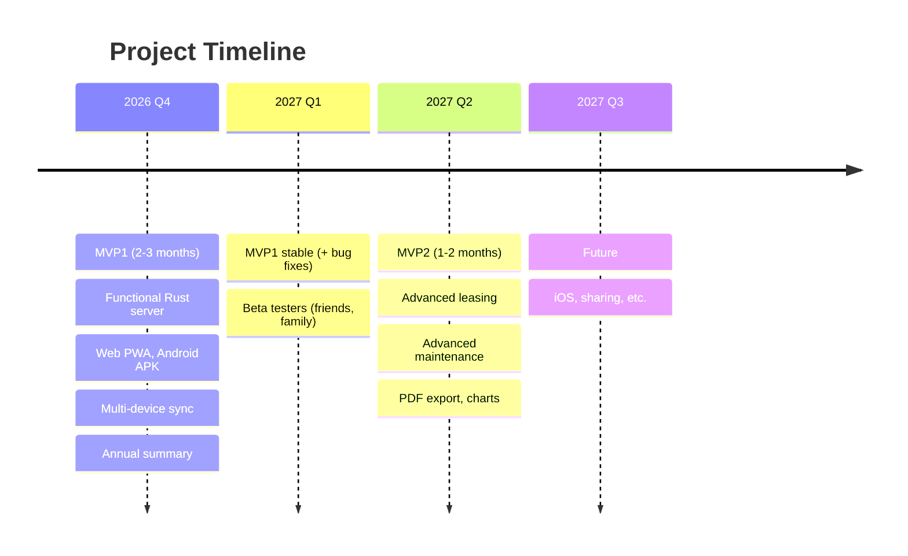

# Roadmap

## Table of contents

- [MVP1 — Minimum Viable Product](#mvp1--minimum-viable-product)
- [MVP2 — Improvements](#mvp2--improvements)
- [Future — Ideas](#future--ideas)
- [Indicative planning](#indicative-planning)
- [Prioritization](#prioritization)
- [Related documents](#related-documents)

---

## MVP1 — Minimum Viable Product

**Objective** : a functional vehicle tracking application, usable daily, with multi-device synchronization.

### Features

| Feature | Description | Status |
|---------|-------------|--------|
| **Account creation** | Username + password only. Argon2id derivation, XChaCha20-Poly1305 encryption. | ☐ |
| **Vehicle CRUD** | Add, edit, delete (soft delete), list. Fields : VIN, brand, model, year, dates, initial mileage, fuel types. | ☐ |
| **Add fill-ups** | Fuel type (pre-filled), amount, liters, mileage, full/partial (partial by default). Price per liter calculation. | ☐ |
| **Add expenses** | All categories : fuel, insurance, maintenance, toll, parking, fine, wash, credit, leasing, tax. | ☐ |
| **Annual summary** | Average consumption (L/100km between full fill-ups), cost per kilometer, total by category. | ☐ |
| **"About" page** | GPL v3 license, source code (GitHub link), author, version. | ☐ |
| **Internationalization (i18n)** | French and English UI. Language switcher. Default: French, fallback: English. Angular i18n + ngx-translate or native Angular i18n. | ☐ |
| **Multi-device sync** | Web (PWA) + Mobile (Android). Local-first, incremental sync via mtime. | ☐ |
| **Conflicts** | Fork detection, manual resolution via UI (choose branch A/B). | ☐ |
| **"Raw events" view** | Timeline of all events (profile + expenses) for debug and transparency. | ☐ |

### MVP1 platforms

| Platform | Technology | Status |
|----------|------------|--------|
| Web | Angular PWA (IndexedDB, Service Worker) | ☐ |
| Android | ng-native / Expo (expo-sqlite) | ☐ |
| iOS | — | ❌ (Future) |

### MVP1 deliverables

- [ ] Deployed web application (installable PWA)
- [ ] Functional Android APK
- [ ] Deployed Rust server (Docker, HTTPS)
- [ ] Complete documentation (this `docs/` folder)
- [ ] Public source code (GitHub, GPL v3 license)

---

## MVP2 — Improvements

**Objective** : enrich the user experience with advanced tracking features.

| Feature | Description | User value | Complexity |
|---------|-------------|------------|------------|
| **Advanced leasing tracking** | Automatic monthly payments, contractual mileage, overage alerts, total leasing cost. | ⭐⭐⭐ High | Medium |
| **Advanced maintenance tracking** | Complete history, reminders by mileage/date (oil change, tires, timing belt, inspection), attached documents/photos. | ⭐⭐⭐ High | Medium |
| **PDF export** | Exportable annual reports in PDF (summary, charts, expense details). | ⭐⭐⭐ High | Medium |
| **Trend charts** | Evolution of consumption, monthly expenses, cost per km. | ⭐⭐⭐ High | Medium |
| **Advanced multi-fuel** | Separate tank management (gasoline + electric for plug-in hybrid), electric charge tracking (kWh). | ⭐⭐ Medium | Medium |
| **Multi-vehicle comparison** | Cross-statistics between vehicles (consumption, cost/km, annual expenses). | ⭐⭐ Medium | Low |
| **Automatic conflict resolution** | Automatic resolution by timestamp (most recent wins), with possibility of manual review. | ⭐⭐ Medium | Low |
| **Dark mode** | Light/dark theme, user preference. | ⭐ Low | Low |

### MVP2 dependencies

- MVP1 complete and stable
- User feedback on core features
- Client-side PDF generation infrastructure (e.g. jsPDF, pdfmake)

---

## Future — Ideas

**Objective** : long-term evolutions, not precisely planned.

| Idea | Description | Interest | Difficulty |
|------|-------------|----------|------------|
| **iOS support** | iOS application via ng-native or React Native. | ⭐⭐⭐ | High (Apple ecosystem, App Store) |
| **Vehicle sharing** | Multiple users on the same vehicle (family, company). Requires shared key management (multi-recipient encryption). | ⭐⭐⭐ | High (complex crypto) |
| **Data import** | CSV import, import from other apps (Fuelio, Car Minder, etc.). | ⭐⭐⭐ | Medium |
| **Public API (read-only)** | Allow third-party apps to read data (with user consent, dedicated API key). | ⭐⭐ | Medium |
| **Custom themes** | Beyond light/dark : customizable colors, seasonal themes. | ⭐ | Low |
| **Push notifications** | Reminders for inspection, insurance end, upcoming service. | ⭐⭐⭐ | Medium (Firebase/APNs) |
| **Mobile widget** | Home screen widget : average consumption, next inspection, mileage. | ⭐⭐ | Medium |
| **OBD-II integration** | Bluetooth connection to the vehicle's OBD-II box to read consumption, mileage, error codes in real time. | ⭐⭐⭐ | High (hardware, protocols) |
| **Cost prediction** | Lightweight client-side ML : prediction of future expenses based on history. | ⭐⭐ | High |
| **Community / forum** | User help space (out of server scope, external link). | ⭐ | Low |
| **Desktop application** | Electron or Tauri version for Windows/Mac/Linux. | ⭐ | Medium |

---

## Indicative planning



| Phase | Estimated duration | Key milestones |
|-------|-------------------|----------------|
| **MVP1** | 2-3 months | Functional Rust server, web PWA, Android APK, multi-device sync, annual summary |
| **MVP1 stabilization** | 1 month | Bug fixes, beta feedback, performance, security |
| **MVP2** | 1-2 months | Advanced leasing, advanced maintenance, PDF export, charts |
| **Future** | Ongoing | iOS, sharing, import, public API (depending on demand) |

---

## Prioritization

### Prioritization criteria

| Criterion | Weight | Description |
|-----------|--------|-------------|
| **User value** | 40% | Solves a real problem, used frequently. |
| **Technical complexity** | 30% | Development time, technical risks. |
| **Dependencies** | 20% | Blocks other features ? Requires what ? |
| **Community demand** | 10% | Number of requests, user votes. |

### Prioritization matrix

```mermaid
quadrantChart
    title Prioritization Matrix
    x-axis: Low Complexity --> High Complexity
    y-axis: Low User Value --> High User Value
    quadrant-1: Future (iOS, sharing)
    quadrant-2: MVP1 / MVP2 (leasing)
    quadrant-3: Backlog (drop)
    quadrant-4: MVP2 / Future (themes)
    MVP1: [0.3, 0.9]
    MVP2 Leasing: [0.6, 0.7]
    Themes: [0.8, 0.3]
    iOS: [0.9, 0.8]
    Sharing: [0.85, 0.75]
```

### Decision rules

1. **MVP1 first** : without the fundamentals (vehicles, fill-ups, expenses, sync), nothing else makes sense.
2. **Stability before features** : a buggy MVP1 is worth less than a simple and robust MVP1.
3. **User demand** : "Future" features move up if demand is strong.
4. **Controlled complexity** : prefer 3 simple features over 1 complex feature.

---

## Related documents

- [MAIN.md](MAIN.md) — Overview, MVP1/MVP2 objectives
- [BUSINESS.md](BUSINESS.md) — Business rules (detailed features)
- [ARCHI.md](ARCHI.md) — Technical architecture
- [DATA.md](DATA.md) — Data models
- [SECURITY.md](SECURITY.md) — Security
- [API.md](API.md) — REST API contract
- [DEPLOYMENT.md](DEPLOYMENT.md) — Deployment
- [LEXICON.md](LEXICON.md) — Definitions

---

*Last updated : 2026-10-09*
