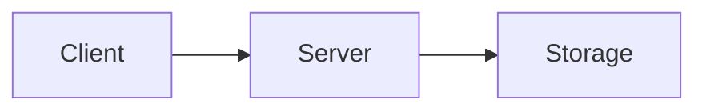

# Tech Stack

Complete definition of languages, frameworks, and libraries for each component.

**Note on configuration files** : When a config file already exists in the repo (e.g., `docs/package.json`, `.github/workflows/docs.yml`), this document links to it instead of duplicating its content. Files that don't exist yet are shown as reference examples to be created during project initialization.

## Table of contents

- [Overview](#overview)
- [1. Server (Rust)](#1-server-rust)
- [2. Shared Core (TypeScript)](#2-shared-core-typescript)
- [3. Web App (Angular)](#3-web-app-angular)
- [4. Mobile App (ng-native)](#4-mobile-app-ng-native)
- [5. DevOps / Infrastructure](#5-devops--infrastructure)
- [6. Documentation (VitePress)](#6-documentation-vitepress)
- [7. Tooling (monorepo)](#7-tooling-monorepo)

---

## Overview

| Component | Language | Framework/Runtime | Key Libraries |
|-----------|----------|-------------------|---------------|
| **Server** | Rust 1.99+ | Axum + Tokio | serde, tower-http, tracing, sha2, uuid |
| **Shared Core** | TypeScript 7+ | — (pure lib) | libsodium.js, argon2-browser, vitest, fast-check, biome |
| **Web** | TypeScript 7+ | Angular 22+ (PWA) | Vitest, Playwright, Signal Forms, IndexedDB native |
| **Mobile** | TypeScript 7+ | ng-native (Angular + Expo) | @ng-native/*, expo-sqlite, vitest, Maestro |
| **Docs** | Markdown | VitePress | vitepress, mermaid |
| **Infra** | YAML / Bash / Docker | Docker Compose + GitHub Actions + Nginx | Alpine, Let's Encrypt |
| **Docs** | Markdown | VitePress | vitepress, mermaid |

---

## 1. Server (Rust)

### Language

| Aspect | Choice | Why |
|--------|--------|-----|
| **Language** | Rust (stable) | Memory safety without GC, zero-cost abstractions, excellent async support, perfect for a lightweight server |
| **Edition** | 2024 | Latest Rust edition (let-else, async closures, gen blocks, etc.) |
| **MSRV** | 1.99.0 | Minimum Supported Rust Version (latest stable) |
| **Toolchain** | `rustup` + `stable` channel | Easy version management, automatic updates |

### Web Framework

| Aspect | Choice | Why |
|--------|--------|-----|
| **Framework** | **Axum** 0.7+ | Built on Tokio + Tower (ecosystem standard), type-safe extractors, excellent ergonomics, actively maintained, perfect for REST APIs |
| **Alternative considered** | Actix-web | Faster in some benchmarks, but more complex API, less composable middleware |
| **Alternative considered** | Actix-web | More mature but heavier, steeper learning curve |

**Why Axum over Actix-web :**
- **Tower ecosystem** : standard middleware (CORS, compression, tracing, rate limiting) works out of the box
- **Type-safe extractors** : `Json<T>`, `Path<T>`, `Query<T>` with automatic deserialization and validation
- **Ergonomics** : simpler API, less boilerplate
- **Tokio native** : first-class async/await support
- **Perfect for our use case** : simple REST API (CRUD blobs), no WebSocket needed (MVP1)

### Async Runtime

| Aspect | Choice | Why |
|--------|--------|-----|
| **Runtime** | **Tokio** 1.x (full features) | De facto standard for async Rust, excellent performance, rich ecosystem |
| **Features** | `full` (or `macros`, `rt-multi-thread`, `fs`, `net`, `time`) | We need: multi-thread runtime, file I/O, networking, timers |

### Serialization

| Crate | Version | Purpose |
|-------|---------|---------|
| `serde` | 1.0 | Serialization framework (derive macros) |
| `serde_json` | 1.0 | JSON serialization (API requests/responses) |

**Why serde :** Industry standard, zero-cost abstractions, works with any format (JSON now, could add CBOR/MessagePack later for binary efficiency).

### HTTP & Middleware

| Crate | Version | Purpose |
|-------|---------|---------|
| `axum` | 0.7 | Web framework (routing, extractors, responses) |
| `tower` | 0.4 | Middleware primitives (Service trait, Layer) |
| `tower-http` | 0.5 | HTTP middleware: CORS, compression, tracing, timeout, limit |
| `hyper` | 1.0 | HTTP implementation (used internally by Axum) |

**Middleware stack (order matters) :**
```rust
use tower_http::{
    cors::CorsLayer,
    compression::CompressionLayer,
    trace::TraceLayer,
    limit::RequestBodyLimitLayer,
    timeout::TimeoutLayer,
};

let app = Router::new()
    .route("/api/...", ...)
    // Applied last = executed first (LIFO)
    .layer(TimeoutLayer::new(Duration::from_secs(30)))
    .layer(RequestBodyLimitLayer::new(10 * 1024 * 1024)) // 10 MB max
    .layer(CompressionLayer::new())
    .layer(CorsLayer::permissive()) // Configured via env in prod
    .layer(TraceLayer::new_for_http());
```

### Logging & Observability

| Crate | Version | Purpose |
|-------|---------|---------|
| `tracing` | 0.1 | Structured logging (spans, events, levels) |
| `tracing-subscriber` | 0.3 | Log formatting (JSON for prod, pretty for dev) |
| `tracing-appender` | 0.2 | Log rotation (daily files) |

**Why tracing over log :** Structured logs (key-value pairs), spans (request lifecycle), filtering by module/level, async-aware.

**Configuration :**
- **Dev** : Pretty-printed, colored, `RUST_LOG=debug`
- **Prod** : JSON format (for log aggregation), daily rotation, `RUST_LOG=info`

### Configuration

| Crate | Version | Purpose |
|-------|---------|---------|
| `dotenvy` | 0.15 | Load `.env` files (dev only) |
| `std::env` | — | Read environment variables (prod) |

**Pattern :** 12-factor app — config via environment variables.

```rust
// server/src/config.rs
pub struct Config {
    pub port: u16,
    pub data_dir: PathBuf,
    pub feature_account_creation: bool,
    pub allowed_origins: Vec<String>,
    pub log_level: String,
}

impl Config {
    pub fn from_env() -> Self {
        Self {
            port: env::var("PORT").unwrap_or("8080".into()).parse().unwrap(),
            data_dir: env::var("DATA_DIR").unwrap_or("./data".into()).into(),
            feature_account_creation: env::var("FEATURE_ACCOUNT_CREATION")
                .unwrap_or("false".into()) == "true",
            allowed_origins: env::var("ALLOWED_ORIGINS")
                .unwrap_or("*".into())
                .split(',')
                .map(|s| s.trim().to_string())
                .collect(),
            log_level: env::var("RUST_LOG").unwrap_or("info".into()),
        }
    }
}
```

### Error Handling

| Crate | Version | Purpose |
|-------|---------|---------|
| `thiserror` | 1.0 | Derive `Error` trait for library errors (typed errors) |
| `anyhow` | 1.0 | Application errors (binaries, context-rich errors) |

**Pattern :**
- **Library code** (`storage.rs`, `auth.rs`) : `thiserror` — typed errors (`StorageError::NotFound`, `StorageError::Io`)
- **Binary code** (`main.rs`, handlers) : `anyhow` — add context with `.context("failed to read user file")`
- **HTTP responses** : `IntoResponse` impl to map errors to status codes

```rust
// Example: typed error
#[derive(Debug, thiserror::Error)]
pub enum StorageError {
    #[error("user not found: {0}")]
    UserNotFound(String),
    #[error("blob not found: {0}")]
    BlobNotFound(String),
    #[error("I/O error: {0}")]
    Io(#[from] std::io::Error),
    #[error("path traversal attempt: {0}")]
    PathTraversal(String),
}

// Map to HTTP status
impl IntoResponse for StorageError {
    fn into_response(self) -> Response {
        let (status, message) = match self {
            StorageError::UserNotFound(_) | StorageError::BlobNotFound(_) => (StatusCode::NOT_FOUND, self.to_string()),
            StorageError::PathTraversal(_) => (StatusCode::BAD_REQUEST, "Invalid path".to_string()),
            StorageError::Io(_) => (StatusCode::INTERNAL_SERVER_ERROR, "Storage error".to_string()),
        };
        (status, Json(json!({ "error": message }))).into_response()
    }
}
```

### Cryptography & Hashing

| Crate | Version | Purpose |
|-------|---------|---------|
| `sha2` | 0.10 | SHA-256 (hash usernames for folder names, verify authHash) |
| `hex` | 0.4 | Hex encoding/decoding (blobs are stored as hex text) |

**Why not more crypto here ?** The server is **zero-knowledge** — it never encrypts/decrypts user data. It only:
- Hashes usernames (SHA-256) for folder names
- Stores `authHash` (SHA-256 of MasterKey, computed client-side)
- Stores/retrieves hex-encoded encrypted blobs (opaque to the server)

**No need for :** AES, RSA, Argon2 (all client-side via libsodium.js).

### Utilities

| Crate | Version | Purpose |
|-------|---------|---------|
| `uuid` | 1.6 | UUID v4 (generate blob IDs if needed, though we use hash chain) |
| `chrono` | 0.4 | Date/time (mtime handling, log timestamps) |
| `tokio::fs` | 1.x | Async file I/O (or `std::fs` if sync is sufficient) |
| `std::path` | — | Path manipulation, sanitization |

### Testing

| Crate | Version | Purpose |
|-------|---------|---------|
| `tokio` (test) | 1.x | `#[tokio::test]` for async tests |
| `tempfile` | 3.8 | Temporary directories for tests |
| `assert-json-diff` | 2.0 | Compare JSON responses in API tests |
| `wiremock` | 0.6 | Mock HTTP server (if we need to test client behavior — not needed for our server tests) |

### Development Tools

| Tool | Purpose |
|------|---------|
| `cargo-watch` | Auto-reload on file changes (`cargo watch -x run`) |
| `cargo-tarpaulin` | Code coverage (`cargo tarpaulin --out Html`) |
| `cargo-audit` | Security audit of dependencies (`cargo audit`) |
| `cargo-clippy` | Linting (`cargo clippy -- -D warnings`) |
| `cargo-fmt` / `rustfmt` | Code formatting (`cargo fmt`) |
| `criterion` | Benchmarks (`cargo bench`) |

### Example `Cargo.toml`

```toml
[package]
name = "vroooom-server"
version = "0.1.0"
edition = "2024"
rust-version = "1.99"
license = "GPL-3.0"

[dependencies]
# Web framework
axum = "0.7"
tokio = { version = "1", features = ["full"] }
tower = "0.4"
tower-http = { version = "0.5", features = ["cors", "compression", "trace", "limit", "timeout"] }
hyper = { version = "1", features = ["full"] }

# Serialization
serde = { version = "1", features = ["derive"] }
serde_json = "1"

# Logging
tracing = "0.1"
tracing-subscriber = { version = "0.3", features = ["env-filter", "json"] }
tracing-appender = "0.2"

# Config
dotenvy = "0.15"

# Errors
thiserror = "1"
anyhow = "1"

# Crypto & encoding
sha2 = "0.10"
hex = "0.4"

# Utilities
uuid = { version = "1", features = ["v4"] }
chrono = { version = "0.4", features = ["serde"] }

[dev-dependencies]
# Testing
tokio = { version = "1", features = ["test-util", "macros"] }
tempfile = "3"
assert-json-diff = "2"

# Benchmarking
criterion = { version = "0.5", features = ["html_reports"] }

[[bench]]
name = "storage"
harness = false

[profile.release]
opt-level = 3
lto = true
codegen-units = 1
strip = true
```

### Project structure

```
server/
├── Cargo.toml
├── Cargo.lock
├── Dockerfile
├── .cargo/
│   └── config.toml          # Custom cargo config (optional)
├── src/
│   ├── main.rs              # Entry point, server setup
│   ├── config.rs            # Configuration from env
│   ├── error.rs             # Error types (thiserror)
│   ├── routes/              # HTTP routes (Axum handlers)
│   │   ├── mod.rs
│   │   ├── auth.rs          # /api/auth/*
│   │   ├── data.rs          # /api/data/*
│   │   └── sync.rs          # /api/sync
│   ├── storage/             # File storage layer
│   │   ├── mod.rs
│   │   ├── user.rs          # User folder management
│   │   └── blob.rs          # Blob storage (read/write hex files)
│   ├── middleware/          # Custom middleware (if needed)
│   │   └── mod.rs
│   └── models/              # Request/response types
│       ├── mod.rs
│       ├── auth.rs          # RegisterRequest, LoginResponse, etc.
│       └── data.rs          # DataRequest, DataResponse, etc.
├── tests/                   # Integration tests
│   ├── api_tests.rs         # Full API flow tests
│   └── storage_tests.rs     # Storage layer tests
└── benches/                 # Benchmarks
    └── storage.rs           # Criterion benchmarks
```

### Build & Run

```bash
# Development (with auto-reload)
cargo watch -x run

# Production build (optimized, stripped)
cargo build --release

# Run production binary
./target/release/vroooom-server

# Docker build
# (see DEPLOYMENT.md)
```

### Performance targets

| Metric | Target | Why |
|--------|--------|-----|
| Binary size | < 5 MB (stripped) | Easy deployment, fast Docker pull |
| **Docker image size** | **< 30 MB** | Alpine runtime (musl static binary) |
| Memory usage | < 20 MB idle | Lightweight VPS (512 MB RAM) |
| Request latency | < 10 ms (p99) | File I/O is fast (local SSD) |
| Concurrent requests | 1000+ | Tokio multi-thread runtime |

### Docker strategy

| Stage | Image | Base | Purpose |
|-------|-------|------|---------|
| **Builder** | `rust:1.99-alpine` | Alpine + musl | Compile Rust (static binary, glibc-free) |
| **Runtime** | `alpine:3.19` | Alpine (musl) | Run binary (minimal, ~5 MB base + binary) |

**Why Alpine for runtime :**
- Tiny base image (~5 MB vs ~80 MB Debian Slim)
- musl libc = static binaries (no dependency hell)
- Smaller attack surface (fewer packages)
- Fast pull/push (bandwidth savings)

**Trade-off** : Builder also on Alpine (musl) to ensure binary compatibility. No glibc/musl mismatch.

---

## 2. Shared Core (TypeScript)

**Location :** `shared/`
**Type :** Pure TypeScript library (no framework, no DOM, no Node-specific APIs)
**Consumed by :** Web (Angular) + Mobile (ng-native)
**Distribution :** npm workspace (monorepo) or `file:../shared` dependency

### Language

| Aspect | Choice | Why |
|--------|--------|-----|
| **Language** | TypeScript 7+ | Type safety, ADT via union types, shared between web/mobile |
| **Target** | ES2022 | Modern JS (top-level await, etc.), supported by all target platforms |
| **Module** | ESM (`"type": "module"`) | Native ES modules, tree-shakeable |
| **Strict mode** | `strict: true` + `noUncheckedIndexedAccess` | Maximum type safety |

### Crypto (the critical part)

| Library | Version | Purpose | Why |
|---------|---------|---------|-----|
| **libsodium.js** | 0.7.15+ | XChaCha20-Poly1305 encryption/decryption | Audited, standard (Signal, etc.), WASM, works in browser + Node |
| **argon2-browser** | 1.18+ | Argon2id KDF (password → MasterKey) | WASM, configurable memory/iterations/parallelism, works in browser + React Native |
| `@noble/hashes` | 1.4+ | SHA-256 (for authHash verification) | Pure JS, audited, lightweight alternative to libsodium for hashing |

**Why libsodium.js over @noble/ciphers :**
- libsodium is **audited** (used by Signal, Proton, etc.)
- Provides both encryption (XChaCha20-Poly1305) and hashing
- WASM performance is excellent
- Single dependency for crypto primitives

**Why argon2-browser :**
- libsodium.js has limited Argon2 support in WASM (no memory-hard tuning in browser)
- argon2-browser is specifically designed for browser/React Native with full parameter control (m=21MB, t=2, p=2)

**Crypto module structure :**
```
shared/src/crypto/
├── index.ts              # Public API (deriveKey, encrypt, decrypt, hash)
├── argon2.ts             # Argon2id wrapper (argon2-browser)
├── xchacha20.ts          # XChaCha20-Poly1305 wrapper (libsodium.js)
├── sha256.ts             # SHA-256 wrapper (@noble/hashes)
├── random.ts             # Secure random (crypto.getRandomValues)
└── hex.ts                # Hex encode/decode utils
```

### Data Types (ADT)

| Aspect | Choice | Why |
|--------|--------|-----|
| **Pattern** | TypeScript union types (discriminated unions) | Type-safe ADT without runtime overhead |
| **Validation** | Manual (type guards) | TypeScript compile-time checks, no runtime schema lib |

**No runtime schema library** — TypeScript types are compile-time only. No Zod, no Yup, no Joi.

```typescript
// shared/src/types/expense.ts
export type ExpenseKind = 'fuel' | 'insurance' | 'maintenance' | 'toll' | 'parking' |
                          'fine' | 'wash' | 'credit' | 'leasing' | 'tax' | 'delete';

export type FuelExpense = {
  kind: 'fuel';
  date: string; // ISO 8601
  mileage: number;
  amount: number; // cents
  liters: number;
  fuelType: string;
  isFull: boolean;
  pricePerLiter?: number;
  odbConsumption?: number;
};

export type Expense = FuelExpense | InsuranceExpense | MaintenanceExpense | ...;

export interface ExpenseEnvelope {
  id: string;        // hash chain
  vehicleId: string;
  parentId: string | null;
  timestamp: number;
  data: Expense;     // encrypted payload (when stored)
}
```

### Sync Engine

| Library | Version | Purpose |
|---------|---------|---------|
| **Pure TypeScript** | — | Hash chain, conflict detection, merge logic (no external deps) |
| `js-sha256` or `@noble/hashes` | — | Hash chain computation (SHA-256) |

**Why no library ?** The sync logic (hash chain, conflict resolution) is custom business logic. We only need SHA-256 (already in crypto module).

### Utilities

| Library | Version | Purpose | Why |
|---------|---------|---------|-----|
| **date-fns** | 3.x | Date formatting/parsing (optional) | Tree-shakeable, immutable, i18n support |
| **nanoid** | 5.x | ID generation (if needed) | Smaller than uuid, secure |

**Note :** We try to minimize dependencies. Most utils are hand-written (hex, base64, date ISO strings).

### Build & Packaging

| Tool | Version | Purpose |
|------|---------|---------|
| **tsup** | 8.x | Build library (ESM + CJS + d.ts) | Fast (esbuild), zero-config, generates types |
| **TypeScript** | 7+ | Type checking + declaration files | `tsc --noEmit` for CI |
| **tsconfig** | — | Strict config (`strict`, `noUncheckedIndexedAccess`, `exactOptionalPropertyTypes`) | Maximum safety |

**`tsup.config.ts` :**
```typescript
import { defineConfig } from 'tsup';

export default defineConfig({
  entry: ['src/index.ts'],
  format: ['esm', 'cjs'],
  dts: true,
  splitting: false,
  sourcemap: true,
  clean: true,
  target: 'es2022',
});
```

### Testing

| Tool | Version | Purpose |
|------|---------|---------|
| **Vitest** | 2.x | Test runner (same as web/mobile) |
| **fast-check** | 3.x | Property-based testing (crypto, sync, hash chain) |
| **@vitest/coverage-v8** | 2.x | Code coverage (V8 native, fast) |

**Coverage targets :**
- Crypto: **100%** (mandatory)
- Sync engine: **90%**
- Types/Utils: **80%**

### Lint & Format

| Tool | Version | Purpose |
|------|---------|---------|
| **Biome** | 2+ | Lint + Format (replaces ESLint + Prettier) | Fast (Rust-based), single tool, zero-config |

**Why Biome over ESLint+Prettier :**
- 10-100x faster (written in Rust)
- Single tool (lint + format + import sorting)
- Zero config (sensible defaults)
- Same config file for all TypeScript projects (shared, web, mobile)

**`biome.json` :**
```json
{
  "$schema": "https://biomejs.dev/schemas/2.0.0/schema.json",
  "organizeImports": { "enabled": true },
  "linter": {
    "enabled": true,
    "rules": {
      "recommended": true,
      "suspicious": { "noExplicitAny": "error" },
      "style": { "useConst": "error" }
    }
  },
  "formatter": {
    "enabled": true,
    "indentStyle": "space",
    "indentWidth": 2
  }
}
```

### Project Structure

```
shared/
├── package.json           # name: "@vroooom/shared"
├── tsconfig.json          # Strict TypeScript config
├── tsup.config.ts         # Build config
├── biome.json             # Lint/format config
├── vitest.config.ts       # Test config
├── src/
│   ├── index.ts           # Public API (barrel export)
│   ├── crypto/
│   │   ├── index.ts
│   │   ├── argon2.ts
│   │   ├── xchacha20.ts
│   │   ├── sha256.ts
│   │   ├── random.ts
│   │   ├── hex.ts
│   │   └── __tests__/
│   ├── sync/
│   │   ├── index.ts
│   │   ├── engine.ts      # Sync orchestration
│   │   ├── conflict.ts    # Fork detection/resolution
│   │   ├── hash-chain.ts  # Hash chain computation
│   │   └── __tests__/
│   ├── types/
│   │   ├── index.ts
│   │   ├── expense.ts     # Expense ADT
│   │   ├── vehicle.ts
│   │   ├── profile.ts
│   │   └── __tests__/
│   └── utils/
│       ├── index.ts
│       ├── date.ts
│       ├── id.ts
│       └── __tests__/
└── dist/                  # Built output (gitignored)
    ├── index.js           # ESM
    ├── index.cjs          # CJS
    └── index.d.ts         # Types
```

### Consumption (Web & Mobile)

**npm workspaces (monorepo)** — the shared core is a workspace package consumed by both web and mobile.

```json
// package.json (root)
{
  "name": "vroooom-monorepo",
  "private": true,
  "workspaces": ["shared", "web", "mobile", "server"]
}
```

Then in `web/package.json` and `mobile/package.json` :
```json
{
  "dependencies": {
    "@vroooom/shared": "workspace:*"
  }
}
```

**Why npm workspaces :**
- No build step needed during development (Vite/Metro resolve source directly via symlink)
- Single `npm install` at root installs all dependencies
- Shared lockfile (`package-lock.json`) = reproducible builds
- TypeScript project references for type-checking across packages

**Root `package.json` scripts :**
```json
{
  "scripts": {
    "dev": "concurrently \"npm run dev -w shared\" \"npm run dev -w web\" \"npm run dev -w mobile\"",
    "build": "npm run build -w shared && npm run build -w web && npm run build -w mobile",
    "test": "npm run test --workspaces",
    "lint": "npm run lint --workspaces",
    "clean": "rm -rf node_modules */node_modules */*/node_modules"
  }
}
```

### Example `package.json`

```json
{
  "name": "@vroooom/shared",
  "version": "0.1.0",
  "type": "module",
  "main": "./dist/index.cjs",
  "module": "./dist/index.js",
  "types": "./dist/index.d.ts",
  "exports": {
    ".": {
      "types": "./dist/index.d.ts",
      "import": "./dist/index.js",
      "require": "./dist/index.cjs"
    }
  },
  "scripts": {
    "build": "tsup",
    "dev": "tsup --watch",
    "test": "vitest",
    "test:coverage": "vitest --coverage",
    "lint": "biome check .",
    "lint:fix": "biome check --write .",
    "format": "biome format --write .",
    "typecheck": "tsc --noEmit"
  },
  "dependencies": {
    "libsodium.js": "^0.7.15",
    "argon2-browser": "^1.18.0",
    "@noble/hashes": "^1.4.0"
  },
  "devDependencies": {
    "typescript": "^7.0.0",
    "tsup": "^8.0.0",
    "vitest": "^2.0.0",
    "@vitest/coverage-v8": "^2.0.0",
    "fast-check": "^3.19.0",
    "@biomejs/biome": "^2.0.0",
    "@types/libsodium.js": "^0.7.0"
  }
}
```

### Security considerations

| Concern | Mitigation |
|---------|------------|
| **Supply chain** | `npm audit`, lockfile (`package-lock.json`), dependabot |
| **Crypto review** | libsodium.js is audited; our wrappers are thin (no custom crypto) |
| **Timing attacks** | Use constant-time comparison (libsodium provides `crypto_verify_32`) |
| **Random generation** | `crypto.getRandomValues()` (CSPRNG), never `Math.random()` |
| **Memory safety** | MasterKey in JS variable (RAM), cleared on app close (`key.fill(0)` if possible) |

---

## 3. Web App (Angular)

**Location :** `web/`
**Type :** Progressive Web App (PWA) — installable, offline-first
**Consumes :** `@vroooom/shared` (crypto, sync, types)

### Language & Framework

| Aspect | Choice | Why |
|--------|--------|-----|
| **Language** | TypeScript 7+ | Same as shared core, strict mode |
| **Framework** | **Angular 22+** | Latest stable, standalone components, signals, zoneless, Signal Forms |
| **Architecture** | Standalone components + **Single File Components (SFC)** | Modern Angular, no NgModules, inline template + styles |
| **Change detection** | Signals + Zoneless (CD) | Default in Angular 22+, better performance, no Zone.js overhead |

**Why Angular 22+ :**
- Standalone components are default (no NgModules boilerplate)
- **Single File Components (SFC)** : `template` and `styles` inline (no `templateUrl`/`styleUrls`)
- **Signal Forms** : new reactive forms based on signals (replaces Reactive Forms)
- Signals are the recommended state management
- Zoneless change detection (stable) = better performance
- Excellent PWA support (`@angular/pwa`)
- Same language as mobile (ng-native) = code sharing

**Project creation :**
```bash
npx @angular/cli@latest new web --standalone --ssr=false --style=css --routing=true
cd web
npm install
```

### Build Tool

| Tool | Version | Purpose |
|------|---------|---------|
| **Angular CLI** | 19+ | Build, serve, test, generate | Uses **esbuild** + **Vite** under the hood (fast builds) |
| **esbuild** | (via Angular CLI) | Bundler | 10-100x faster than Webpack |
| **Vite** | (via Angular CLI) | Dev server | Instant HMR |

**Build targets :**
- **Dev** : `ng serve` (Vite dev server, port 4200)
- **Prod** : `ng build` (esbuild, optimized, hashed filenames)

### PWA (Progressive Web App)

| Package | Version | Purpose |
|---------|---------|---------|
| **@angular/pwa** | 22+ | Service Worker, manifest, install prompt |
| **@angular/service-worker** | 22+ | Service Worker implementation (ngsw) |

**PWA features :**
- Offline support (Service Worker caches app shell + API responses)
- Installable (Add to Home Screen)
- App manifest (`manifest.webmanifest`)
- Background sync (future)

**Service Worker strategy :**
- App shell : `prefetch` (cached on install)
- API calls : `networkFirst` (try network, fallback to cache)
- Encrypted blobs : cached locally (IndexedDB), synced when online

### State Management

| Aspect | Choice | Why |
|--------|--------|-----|
| **Primary** | **Signals** (Angular built-in) | Reactive primitives, no boilerplate, perfect for local state |
| **Global state** | **Services with signals** | Singleton services holding signals (e.g., `AuthService`, `VehicleService`) |
| **No NgRx** | — | Overkill for MVP1, adds complexity (actions, reducers, effects) |

**Pattern :**
```typescript
// web/src/app/core/services/vehicle.service.ts
@Injectable({ providedIn: 'root' })
export class VehicleService {
  private vehicles = signal<Vehicle[]>([]);
  readonly vehicles$ = this.vehicles.asReadonly();

  private syncService = inject(SyncService);

  async loadVehicles() {
    const local = await this.syncService.getLocalVehicles();
    this.vehicles.set(local);
  }

  async addVehicle(vehicle: Vehicle) {
    await this.syncService.addVehicle(vehicle);
    this.vehicles.update(v => [...v, vehicle]);
  }
}
```

**Future :** If state complexity grows (MVP2+), consider NgRx or @ngrx/signals.

### Routing

| Package | Version | Purpose |
|---------|---------|---------|
| **@angular/router** | 22+ | Client-side routing |

**Features :**
- Lazy loading (standalone components)
- Route guards (auth guard)
- Preloading strategy (prefetch on idle)

```typescript
// web/src/app/app.routes.ts
export const routes: Routes = [
  { path: 'login', loadComponent: () => import('./features/auth/login.component') },
  {
    path: 'dashboard',
    loadComponent: () => import('./features/dashboard/dashboard.component'),
    canActivate: [authGuard]
  },
  { path: 'vehicles/:id', loadComponent: () => import('./features/vehicles/vehicle-detail.component') },
  { path: '**', redirectTo: 'dashboard' }
];
```

### HTTP

| Package | Version | Purpose |
|---------|---------|---------|
| **@angular/common/http** | 22+ | HttpClient for API calls |

**Pattern :**
```typescript
@Injectable({ providedIn: 'root' })
export class ApiService {
  private http = inject(HttpClient);
  private baseUrl = environment.apiUrl;

  getExpenses(vehicleId: string): Observable<EncryptedBlob[]> {
    return this.http.get<EncryptedBlob[]>(`${this.baseUrl}/api/data?vehicleId=${vehicleId}`);
  }

  uploadBlob(id: string, data: string): Observable<void> {
    return this.http.put<void>(`${this.baseUrl}/api/data/${id}`, { data });
  }
}
```

### Local Storage (IndexedDB native)

| API | Purpose |
|-----|---------|
| **IndexedDB API** (native browser) | Structured storage for encrypted blobs |

**Why native IndexedDB (no Dexie.js) :**
- No dependency (one less package to maintain)
- Native API is sufficient for our use case (key-value storage + simple queries)
- We write a thin wrapper (~100 lines) for Promise-based API
- Full control over transactions and error handling

**Wrapper (`web/src/app/core/db/indexeddb.ts`) :**
```typescript
// Thin Promise-based wrapper over IndexedDB

export class IndexedDBStore {
  private db: IDBDatabase | null = null;

  async open(name: string, version: number, stores: string[]): Promise<void> {
    return new Promise((resolve, reject) => {
      const request = indexedDB.open(name, version);
      request.onupgradeneeded = () => {
        const db = request.result;
        stores.forEach(store => {
          if (!db.objectStoreNames.contains(store)) {
            db.createObjectStore(store, { keyPath: 'id' });
          }
        });
      };
      request.onsuccess = () => { this.db = request.result; resolve(); };
      request.onerror = () => reject(request.error);
    });
  }

  async put<T extends { id: string }>(store: string, value: T): Promise<void> {
    return new Promise((resolve, reject) => {
      const tx = this.db!.transaction(store, 'readwrite');
      tx.objectStore(store).put(value);
      tx.oncomplete = () => resolve();
      tx.onerror = () => reject(tx.error);
    });
  }

  async get<T>(store: string, id: string): Promise<T | undefined> {
    return new Promise((resolve, reject) => {
      const tx = this.db!.transaction(store, 'readonly');
      const request = tx.objectStore(store).get(id);
      request.onsuccess = () => resolve(request.result);
      request.onerror = () => reject(request.error);
    });
  }

  async getAll<T>(store: string): Promise<T[]> {
    return new Promise((resolve, reject) => {
      const tx = this.db!.transaction(store, 'readonly');
      const request = tx.objectStore(store).getAll();
      request.onsuccess = () => resolve(request.result);
      request.onerror = () => reject(request.error);
    });
  }

  async delete(store: string, id: string): Promise<void> {
    return new Promise((resolve, reject) => {
      const tx = this.db!.transaction(store, 'readwrite');
      tx.objectStore(store).delete(id);
      tx.oncomplete = () => resolve();
      tx.onerror = () => reject(tx.error);
    });
  }
}
```

**Schema (object stores) :**
- `vehicles` (key: `id`) — encrypted_data, created_at, updated_at, dirty, synced_at
- `expenses` (key: `id`, index: `vehicle_id`, `dirty`) — encrypted_data, kind, date, mileage, dirty, synced_at
- `profile` (key: `id=1`) — encrypted_data, updated_at, dirty

### Forms (Signal Forms)

| Package | Version | Purpose |
|---------|---------|---------|
| **@angular/forms/signals** | 22+ | **Signal Forms** (new in Angular 20+, stable in 22) |

**Why Signal Forms over Reactive Forms :**
- Based on **signals** (consistent with our state management)
- Automatic dependency tracking (no manual `valueChanges` subscriptions)
- Better type inference
- Simpler API
- Zoneless-compatible (no Zone.js needed)
- Replaces Reactive Forms in new Angular projects

**Example :**
```typescript
// web/src/app/features/vehicles/vehicle-form.component.ts
import { Component, signal } from '@angular/core';
import { form, required, min, pattern } from '@angular/forms/signals';

@Component({
  selector: 'app-vehicle-form',
  template: `
    <form (submit)="onSubmit()">
      <input [field]="vehicleForm.brand" placeholder="Brand" />
      @if (vehicleForm.brand().errors().length > 0) {
        <span>Brand is required</span>
      }
      <input [field]="vehicleForm.model" placeholder="Model" />
      <input [field]="vehicleForm.year" type="number" placeholder="Year" />
      <input [field]="vehicleForm.vin" placeholder="VIN" />
      <button type="submit" [disabled]="vehicleForm().invalid()">Save</button>
    </form>
  `
})
export class VehicleFormComponent {
  vehicleModel = signal({
    brand: '',
    model: '',
    year: new Date().getFullYear(),
    vin: ''
  });

  vehicleForm = form(this.vehicleModel, (schema) => {
    required(schema.brand);
    required(schema.model);
    min(schema.year, 1900);
    pattern(schema.vin, /^[A-HJ-NPR-Z0-9]{17}$/);
  });

  onSubmit() {
    if (this.vehicleForm().valid()) {
      console.log(this.vehicleModel());
    }
  }
}
```

### Styling (CSS natif)

| Aspect | Choice | Why |
|--------|--------|-----|
| **Language** | **CSS natif** (vanilla) | No preprocessor, no build step, native browser features |
| **Scoping** | Component-scoped (Angular default) | Styles are encapsulated per component |
| **Methodology** | BEM-like naming | Simple, no framework needed |
| **CSS Features** | Nesting, custom properties (CSS variables), container queries | Modern CSS (supported in all target browsers) |

**Why CSS natif (no SCSS) :**
- No preprocessor = simpler build
- Native CSS nesting is now supported (Chrome 112+, Safari 16.5+, Firefox 117+)
- CSS custom properties (variables) are well-supported
- Less abstraction = easier to debug
- Angular 22+ uses CSS by default (SCSS is optional)

**Example (Single File Component) :**
```typescript
@Component({
  selector: 'app-vehicle-card',
  template: `
    <div class="card">
      <h3 class="card__title">{{ vehicle.brand }} {{ vehicle.model }}</h3>
      <p class="card__year">{{ vehicle.year }}</p>
      <button class="card__action" (click)="onDelete()">Delete</button>
    </div>
  `,
  styles: `
    .card {
      border: 1px solid var(--color-border);
      border-radius: 8px;
      padding: 16px;

      &__title {
        font-size: 18px;
        font-weight: 600;
        margin: 0 0 8px;
      }

      &__year {
        color: var(--color-text-secondary);
        margin: 0 0 16px;
      }

      &__action {
        background: var(--color-danger);
        color: white;
        border: none;
        padding: 8px 16px;
        border-radius: 4px;
        cursor: pointer;

        &:hover {
          background: var(--color-danger-dark);
        }
      }
    }
  `
})
export class VehicleCardComponent {
  vehicle = input.required<Vehicle>();
  delete = output<string>();

  onDelete() {
    this.delete.emit(this.vehicle().id);
  }
}
```

### Internationalization (i18n)

| Package | Version | Purpose |
|---------|---------|---------|
| **@angular/localize** | 22+ | Native Angular i18n (build-time translation) |

**Why @angular/localize over ngx-translate :**
- Native Angular (no runtime overhead)
- Build-time translation (smaller bundle)
- Type-safe (extracted messages are typed)
- Supports pluralization, gender, etc.

**Alternative :** `ngx-translate` (runtime translation, simpler for MVP if we need dynamic language switching without rebuild).

**Structure :**
```
web/src/locale/
├── messages.fr.xlf   # French (default)
└── messages.en.xlf   # English (fallback)
```

### UI Components

| Aspect | Choice | Why |
|--------|--------|-----|
| **Base** | **Custom components** | Full control, no heavy dependency, consistent design |
| **Icons** | **@ng-icons** or inline SVG | Lightweight, tree-shakeable |
| **Future** | Angular Material or custom design system | Can add later if needed |

**Component library structure :**
```
web/src/app/shared/components/
├── button/
├── input/
├── card/
├── modal/
├── toast/
└── layout/
```

### Crypto & Sync

| Source | Usage |
|--------|-------|
| **@vroooom/shared** | All crypto (Argon2id, XChaCha20), sync engine, types |

**No crypto code in web/** — everything comes from shared core.

### Testing

| Type | Tool | Version | Purpose |
|------|------|---------|---------|
| **Unit** | **Vitest** | 2.x | Components, services, guards (fast, ESM native) |
| **E2E** | **Playwright** | 1.45+ | Smoke tests (critical flows only) |
| **A11y** | **axe-core** | 4.x | Accessibility testing (via Playwright) |
| **Coverage** | @vitest/coverage-v8 | 2.x | V8 native coverage |

**Vitest config (`vitest.config.ts`) :**
```typescript
import { defineConfig } from 'vitest/config';
import angular from '@analogjs/vite-plugin-angular';

export default defineConfig({
  plugins: [angular()],
  test: {
    globals: true,
    environment: 'jsdom',
    setupFiles: ['./src/test-setup.ts'],
    coverage: {
      provider: 'v8',
      reporter: ['text', 'html', 'lcov'],
      include: ['src/**/*.ts'],
      exclude: ['src/**/*.spec.ts', 'src/main.ts']
    }
  }
});
```

### Lint & Format

| Tool | Version | Purpose |
|------|---------|---------|
| **Biome** | 2+ | Lint + Format (same as shared core) |

### Environments

| File | Purpose |
|------|---------|
| `src/environments/environment.ts` | Production config |
| `src/environments/environment.development.ts` | Dev config (localhost API) |

```typescript
// environment.development.ts
export const environment = {
  production: false,
  apiUrl: 'http://localhost:8080/api',
  argon2: { memory: 21504, iterations: 2, parallelism: 2 }
};
```

### Single File Components (SFC)

All components are **Single File Components** — template and styles are inline (no `templateUrl`, no `styleUrls`).

**Rules :**
- ✅ `template: \`...\`` (inline)
- ✅ `styles: \`...\`` ou `styles: [\`...\`]` (inline)
- ❌ No `templateUrl`
- ❌ No `styleUrls`
- ✅ Granular components (one component per file, one responsibility)

**Example SFC :**
```typescript
// web/src/app/features/vehicles/vehicle-list.component.ts
import { Component, input, output } from '@angular/core';

@Component({
  selector: 'app-vehicle-list',
  template: `
    <div class="vehicle-list">
      @for (vehicle of vehicles(); track vehicle.id) {
        <app-vehicle-card
          [vehicle]="vehicle"
          (delete)="onDelete($event)"
        />
      } @empty {
        <p class="empty-state">No vehicles yet</p>
      }
    </div>
  `,
  styles: `
    .vehicle-list {
      display: grid;
      grid-template-columns: repeat(auto-fill, minmax(300px, 1fr));
      gap: 16px;
    }

    .empty-state {
      color: var(--color-text-secondary);
      text-align: center;
      padding: 48px;
    }
  `
})
export class VehicleListComponent {
  vehicles = input.required<Vehicle[]>();
  delete = output<string>();

  onDelete(id: string) {
    this.delete.emit(id);
  }
}
```

### Project Structure

```
web/
├── package.json
├── angular.json           # Angular CLI config
├── tsconfig.json          # TypeScript config (strict)
├── vitest.config.ts       # Vitest config
├── playwright.config.ts   # E2E config
├── biome.json             # Lint/format (extends root)
├── src/
│   ├── index.html
│   ├── main.ts            # Bootstrap
│   ├── styles.css         # Global styles (CSS natif)
│   ├── app/
│   │   ├── app.component.ts
│   │   ├── app.config.ts  # Providers (router, http, etc.)
│   │   ├── app.routes.ts  # Routes
│   │   ├── core/          # Singleton services, guards, interceptors
│   │   │   ├── services/
│   │   │   │   ├── auth.service.ts
│   │   │   │   ├── api.service.ts
│   │   │   │   ├── sync.service.ts
│   │   │   │   └── crypto.service.ts  # Wraps @vroooom/shared
│   │   │   ├── guards/
│   │   │   │   └── auth.guard.ts
│   │   │   ├── interceptors/
│   │   │   │   └── auth.interceptor.ts
│   │   │   └── db/
│   │   │       └── indexeddb.ts  # IndexedDB wrapper (native API)
│   │   ├── shared/        # Reusable components, pipes, directives
│   │   │   ├── components/
│   │   │   ├── pipes/
│   │   │   └── directives/
│   │   └── features/      # Feature modules (lazy-loaded)
│   │       ├── auth/
│   │       ├── dashboard/
│   │       ├── vehicles/
│   │       ├── expenses/
│   │       └── settings/
│   ├── assets/
│   │   ├── i18n/          # Translation files
│   │   └── icons/
│   └── environments/
├── e2e/                   # Playwright tests
│   └── smoke.spec.ts
└── public/                # Static assets (manifest, icons)
    ├── manifest.webmanifest
    └── icons/
```

### Example `package.json`

```json
{
  "name": "@vroooom/web",
  "version": "0.1.0",
  "scripts": {
    "dev": "ng serve",
    "build": "ng build",
    "preview": "ng serve --configuration production",
    "test": "vitest",
    "test:watch": "vitest --watch",
    "test:coverage": "vitest --coverage",
    "e2e": "playwright test",
    "lint": "biome check src",
    "lint:fix": "biome check --write src",
    "format": "biome format --write src"
  },
  "dependencies": {
    "@angular/animations": "^22.0.0",
    "@angular/common": "^22.0.0",
    "@angular/compiler": "^22.0.0",
    "@angular/core": "^22.0.0",
    "@angular/forms": "^22.0.0",
    "@angular/platform-browser": "^22.0.0",
    "@angular/platform-browser-dynamic": "^22.0.0",
    "@angular/router": "^22.0.0",
    "@angular/service-worker": "^22.0.0",
    "@angular/localize": "^22.0.0",
    "@vroooom/shared": "workspace:*",
    "rxjs": "^7.8.0",
    "tslib": "^2.6.0",
    "zone.js": "^0.15.0"
  },
  "devDependencies": {
    "@angular-devkit/build-angular": "^22.0.0",
    "@angular/cli": "^22.0.0",
    "@angular/compiler-cli": "^22.0.0",
    "@analogjs/vite-plugin-angular": "^1.0.0",
    "@playwright/test": "^1.45.0",
    "@axe-core/playwright": "^4.9.0",
    "@biomejs/biome": "^2.0.0",
    "@vitest/coverage-v8": "^2.0.0",
    "jsdom": "^24.0.0",
    "typescript": "^7.0.0",
    "vitest": "^2.0.0"
  }
}
```

### Build & Deploy

```bash
# Create the project (first time)
npx @angular/cli@latest new web --standalone --ssr=false --style=css --routing=true
cd web
npm install

# Dev
npm run dev          # ng serve (http://localhost:4200)

# Production build
npm run build        # → dist/web/ (static files)

# Preview production build
npm run preview

# Deploy (static hosting)
# - Copy dist/web/ to server
# - Or use GitHub Pages, Netlify, Vercel, etc.
# - Or serve via the Rust server (static files endpoint)
```

---

## 4. Mobile App (ng-native)

**Location :** `mobile/`
**Type :** Native Android app (iOS future) via Expo
**Consumes :** `@vroooom/shared` (crypto, sync, types)

### Overview

ng-native allows building **native iOS/Android apps** with **Angular** (no React in the render path). It uses **Expo** for the build pipeline and Metro for bundling.

**Project creation :**
```bash
npx create-expo-app@latest mobile --template @ng-native/template
cd mobile
```

### Language & Framework

| Aspect | Choice | Why |
|--------|--------|-----|
| **Language** | TypeScript 7+ | Same as web + shared core |
| **Framework** | **ng-native** (Angular + Expo) | Native views with Angular, no React |
| **Angular version** | 22+ (via ng-native) | Same as web app |
| **Runtime** | **Expo** (React Native under the hood) | Easy build, OTA updates, Expo Go for dev |
| **Bundler** | **Metro** | Configured by ng-native template |

**Why ng-native :**
- Same language/framework as web (Angular) = maximum code sharing
- Native performance (no WebView)
- Expo ecosystem (easy builds, updates, deployment)
- Test new technology with contained risk

### Native Components

| Package | Purpose |
|---------|---------|
| **@ng-native/components** | Native components: `View`, `Text`, `Pressable`, `SafeAreaView`, `ScrollView`, `TextInput`, etc. |
| **@ng-native/router** | Navigation (screens, stack, tabs) |
| **@ng-native/device** | Device APIs (haptics, storage, etc.) |
| **@ng-native/expo** | Expo-specific integrations |
| **@ng-native/tailwind** | Tailwind CSS support (optional) |

**Important :** Use **lowercase** element names (`<view>`, `<text>`, not `<View>`, `<Text>`). Angular treats uppercase as unknown components.

**Example component :**
```typescript
// mobile/src/app/features/vehicles/vehicle-list.component.ts
import { Component, input, output, signal } from '@angular/core';
import { View, Text, Pressable, SafeAreaView, ScrollView } from '@ng-native/components';

@Component({
  selector: 'app-vehicle-list',
  imports: [View, Text, Pressable, SafeAreaView, ScrollView],
  template: `
    <safe-area-view class="screen">
      <scroll-view class="container">
        @for (vehicle of vehicles(); track vehicle.id) {
          <pressable class="card" (press)="onSelect(vehicle.id)">
            <text class="card-title">{{ vehicle.brand }} {{ vehicle.model }}</text>
            <text class="card-subtitle">{{ vehicle.year }}</text>
          </pressable>
        } @empty {
          <text class="empty">No vehicles yet</text>
        }
      </scroll-view>
    </safe-area-view>
  `,
  styles: `
    .screen {
      flex: 1;
      background-color: #ffffff;
    }
    .container {
      flex: 1;
      padding: 16px;
    }
    .card {
      background-color: #f5f5f5;
      border-radius: 8px;
      padding: 16px;
      margin-bottom: 12px;
    }
    .card-title {
      font-size: 18px;
      font-weight: 600;
    }
    .card-subtitle {
      font-size: 14px;
      color: #666;
    }
    .empty {
      text-align: center;
      color: #999;
      margin-top: 48px;
    }
  `
})
export class VehicleListComponent {
  vehicles = input.required<Vehicle[]>();
  select = output<string>();

  onSelect(id: string) {
    this.select.emit(id);
  }
}
```

### Styling

| Aspect | Choice | Why |
|--------|--------|-----|
| **Method** | **Class strings** (like Tailwind) | ng-native resolves classes to native styles |
| **CSS Engine** | Yoga (layout) + native styles | No DOM, native performance |
| **Tailwind** | Optional (@ng-native/tailwind) | Utility-first CSS if needed |

**Note :** Styles are **not CSS** in the browser sense. They are resolved to native style props (e.g., `class="flex-1 p-4"` → `flex: 1, padding: 16`).

### State Management

| Aspect | Choice | Why |
|--------|--------|-----|
| **Primary** | **Signals** (Angular built-in) | Same as web app |
| **Services** | `@Injectable({ providedIn: 'root' })` | Singleton services with signals |

Same pattern as web app — services hold signals, components read them.

### Navigation

| Package | Purpose |
|---------|---------|
| **@ng-native/router** | File-based or declarative routing (screens, stack, tabs) |

```typescript
// mobile/src/app/app.routes.ts
import { Routes } from '@ng-native/router';

export const routes: Routes = [
  { path: '', component: HomeScreen },
  { path: 'vehicles/:id', component: VehicleDetailScreen },
  { path: 'settings', component: SettingsScreen }
];
```

### Local Storage

| Package | Version | Purpose |
|---------|---------|---------|
| **expo-sqlite** | 14+ | SQLite database (same schema as web IndexedDB) |

**Why expo-sqlite :**
- Native SQLite (fast, reliable)
- Same schema as web (metadata + encrypted_data)
- Sync API (SQLite ↔ IndexedDB compatible)

**Schema (same as web) :**
```sql
CREATE TABLE vehicles (
  id TEXT PRIMARY KEY,
  encrypted_data TEXT NOT NULL,  -- hex blob
  created_at TEXT NOT NULL,
  updated_at TEXT NOT NULL,
  dirty INTEGER DEFAULT 1,
  synced_at TEXT
);

CREATE TABLE expenses (
  id TEXT PRIMARY KEY,
  vehicle_id TEXT NOT NULL,
  kind TEXT NOT NULL,
  date TEXT NOT NULL,
  mileage INTEGER,
  encrypted_data TEXT NOT NULL,
  dirty INTEGER DEFAULT 1,
  synced_at TEXT
);

CREATE INDEX idx_expenses_vehicle ON expenses(vehicle_id);
CREATE INDEX idx_expenses_dirty ON expenses(dirty);
```

**Wrapper (`mobile/src/app/core/db/sqlite.ts`) :**
```typescript
import * as SQLite from 'expo-sqlite';

export class SQLiteStore {
  private db: SQLite.SQLiteDatabase;

  async open(): Promise<void> {
    this.db = await SQLite.openDatabaseAsync('vroooom.db');
    await this.db.execAsync(`
      CREATE TABLE IF NOT EXISTS vehicles (...);
      CREATE TABLE IF NOT EXISTS expenses (...);
    `);
  }

  async insertVehicle(vehicle: VehicleRow): Promise<void> {
    await this.db.runAsync(
      'INSERT OR REPLACE INTO vehicles (id, encrypted_data, created_at, updated_at, dirty) VALUES (?, ?, ?, ?, ?)',
      [vehicle.id, vehicle.encrypted_data, vehicle.created_at, vehicle.updated_at, vehicle.dirty]
    );
  }

  async getVehicles(): Promise<VehicleRow[]> {
    return this.db.getAllAsync<VehicleRow>('SELECT * FROM vehicles');
  }

  async getDirtyExpenses(): Promise<ExpenseRow[]> {
    return this.db.getAllAsync<ExpenseRow>('SELECT * FROM expenses WHERE dirty = 1');
  }
}
```

### Crypto & Sync

| Source | Usage |
|--------|-------|
| **@vroooom/shared** | All crypto (Argon2id, XChaCha20), sync engine, types |

**No crypto code in mobile/** — everything comes from shared core.

**Note :** libsodium.js and argon2-browser work in React Native/Expo (WASM support).

### HTTP

| Method | Purpose |
|--------|---------|
| **fetch** (global) | HTTP calls to the Rust server |
| **expo/fetch** | Expo's fetch polyfill (if needed) |

ng-native supports standard `fetch` or Angular's `HttpClient` (via @angular/common/http).

### Internationalization (i18n)

| Package | Purpose |
|---------|---------|
| **expo-localization** | Device locale detection |
| **i18n-js** or **@ng-native/localization** | Translation files (JSON) |

**Structure :**
```
mobile/src/i18n/
├── fr.json    # French (default)
├── en.json    # English (fallback)
└── index.ts   # i18n config
```

### Testing

| Type | Tool | Version | Purpose |
|------|------|---------|---------|
| **Unit** | **Vitest** + **@ng-native/testing** | 2.x / latest | Components, services (fake Fabric, no simulator) |
| **E2E** | **Maestro** | latest | Smoke tests on real device/emulator |

**@ng-native/testing provides :**
- `render()` — mount component on fake Fabric
- `screen` — queries (`getByText`, `getByRole`, etc.)
- `userEvent` — interactions (`press`, `type`, etc.)
- `fabric` — access to raw native tree

**No TestBed, no DOM, no ComponentFixture.**

### Build & Deploy

| Command | Purpose |
|---------|---------|
| `npx expo start` | Dev server (Metro + Expo Go) |
| `npx expo run:android` | Build & run on Android (debug) |
| `npx expo run:android --variant release` | Build release APK |
| `npx expo run:ios` | Build & run on iOS (macOS only) |
| `eas build` | Cloud build (EAS) |

**Android APK :** `npx expo run:android --variant release` → `android/app/build/outputs/apk/release/app-release.apk`

### Project Structure

```
mobile/                          # Created by create-expo-app
├── package.json
├── app.json                     # Expo config
├── metro.config.js              # Metro bundler (ng-native preset)
├── tsconfig.json
├── vitest.config.ts             # Vitest + @ng-native/testing
├── babel.config.js              # Babel (Expo)
├── src/
│   ├── app/
│   │   ├── app.ts               # Root component (entry point)
│   │   ├── app.routes.ts        # Routes (@ng-native/router)
│   │   ├── core/                # Singleton services
│   │   │   ├── services/
│   │   │   │   ├── auth.service.ts
│   │   │   │   ├── api.service.ts
│   │   │   │   └── sync.service.ts
│   │   │   ├── db/
│   │   │   │   └── sqlite.ts    # expo-sqlite wrapper
│   │   │   └── crypto.service.ts # Wraps @vroooom/shared
│   │   ├── shared/              # Reusable components
│   │   │   └── components/
│   │   │       ├── button.component.ts
│   │   │       ├── card.component.ts
│   │   │       └── input.component.ts
│   │   └── features/            # Feature screens
│   │       ├── auth/
│   │       │   └── login.component.ts
│   │       ├── vehicles/
│   │       │   ├── vehicle-list.component.ts
│   │       │   └── vehicle-detail.component.ts
│   │       └── expenses/
│   │           └── expense-form.component.ts
│   └── i18n/
│       ├── fr.json
│       ├── en.json
│       └── index.ts
├── assets/                      # Images, fonts
├── e2e/                         # Maestro tests
│   └── flows/
│       └── smoke.yaml
└── android/                     # Native Android project (generated)
```

### Example `package.json`

```json
{
  "name": "@vroooom/mobile",
  "version": "0.1.0",
  "main": "src/app/app.ts",
  "scripts": {
    "start": "expo start",
    "android": "expo run:android",
    "ios": "expo run:ios",
    "test": "vitest",
    "test:watch": "vitest --watch",
    "test:coverage": "vitest --coverage",
    "e2e": "maestro test e2e/flows/",
    "lint": "biome check src",
    "lint:fix": "biome check --write src",
    "format": "biome format --write src"
  },
  "dependencies": {
    "@vroooom/shared": "workspace:*",
    "@ng-native/components": "latest",
    "@ng-native/router": "latest",
    "@ng-native/device": "latest",
    "@ng-native/expo": "latest",
    "expo": "~51.0.0",
    "expo-sqlite": "~14.0.0",
    "expo-localization": "~15.0.0",
    "expo-constants": "~16.0.0",
    "expo-status-bar": "~1.12.0",
    "react": "18.2.0",
    "react-native": "0.74.0",
    "i18n-js": "^4.4.0"
  },
  "devDependencies": {
    "@biomejs/biome": "^2.0.0",
    "@ng-native/testing": "latest",
    "@types/react": "^18.2.0",
    "typescript": "^7.0.0",
    "vitest": "^2.0.0",
    "@vitest/coverage-v8": "^2.0.0"
  }
}
```

### Platform Support

| Platform | Status | Notes |
|----------|--------|-------|
| **Android** | ✅ MVP1 | Primary target, APK distribution |
| **iOS** | 🔮 Future | Requires macOS + Xcode, App Store distribution |

---

## 5. DevOps / Infrastructure

### Overview

| Aspect | Choice | Why |
|--------|--------|-----|
| **Containerization** | Docker (multi-stage, Alpine) | Reproducible builds, lightweight images (< 30 MB) |
| **Orchestration** | Docker Compose | Simple, sufficient for single-server deployment |
| **CI/CD** | GitHub Actions | Free for public repos, integrated with GitHub |
| **Registry** | GitHub Container Registry (ghcr.io) | Free, integrated with Actions |
| **Hosting** | Self-hosted (any Linux) | User-managed (VPS, RPi, NAS, cloud) | Docker or native binary |
| **Reverse Proxy** | Nginx (or Traefik) | HTTPS termination, rate limiting, static files |
| **SSL/TLS** | Let's Encrypt (certbot) | Free, automated renewal |
| **Monitoring** | Docker logs + optional Prometheus | Simple logs for MVP1 |
| **Backup** | Git (data folder) | Simple, versioned, off-site via git push |

### Containerization (Docker)

**Multi-stage build (Alpine) :**
```dockerfile
# Build stage
FROM rust:1.99-alpine AS builder
WORKDIR /app
COPY . .
RUN cargo build --release

# Runtime stage
FROM alpine:3.19
RUN apk add --no-cache ca-certificates
RUN adduser -D -u 1000 vroooom
COPY --from=builder /app/target/release/vroooom-server /usr/local/bin/
USER vroooom
EXPOSE 8080
CMD ["vroooom-server"]
```

**Image details :**
- Base : Alpine 3.19 (musl libc, ~5 MB)
- Binary : statically linked (Rust + musl)
- Size : ~20-30 MB
- Security : non-root user, read-only filesystem (optional)

### Orchestration (Docker Compose)

**`docker-compose.yml` :**
```yaml
version: "3.8"

services:
  vroooom-server:
    image: ghcr.io/kuroidoruido/vroooom-server:latest
    # ou build: ./server (pour build local)
    container_name: vroooom-server
    restart: unless-stopped
    environment:
      - FEATURE_ACCOUNT_CREATION=false
      - DATA_DIR=/data
      - PORT=8080
      - RUST_LOG=info
      - ALLOWED_ORIGINS=https://app.vroooom.example.com
    volumes:
      - ./data:/data                    # Persistance des données
    expose:
      - "8080"                          # Interne uniquement
    networks:
      - vroooom-network
    user: "1000:1000"                   # Non-root
    read_only: true                     # Filesystem read-only
    tmpfs:
      - /tmp                            # Seul /tmp est writable
    security_opt:
      - no-new-privileges:true
    healthcheck:
      test: ["CMD", "wget", "-q", "--spider", "http://localhost:8080/api/health"]
      interval: 30s
      timeout: 3s
      retries: 3

  nginx:
    image: nginx:alpine
    container_name: vroooom-nginx
    restart: unless-stopped
    ports:
      - "80:80"                         # HTTP (redirection HTTPS)
      - "443:443"                       # HTTPS
    volumes:
      - ./nginx.conf:/etc/nginx/nginx.conf:ro
      - ./certbot/conf:/etc/letsencrypt:ro
      - ./certbot/www:/var/www/certbot:ro
    networks:
      - vroooom-network
    depends_on:
      - vroooom-server

  certbot:
    image: certbot/certbot:latest
    container_name: vroooom-certbot
    volumes:
      - ./certbot/conf:/etc/letsencrypt
      - ./certbot/www:/var/www/certbot
    entrypoint: "/bin/sh -c 'trap exit TERM; while :; do certbot renew; sleep 12h & wait $${!}; done;'"

networks:
  vroooom-network:
    driver: bridge
```

**Alternative :** Docker simple (sans Compose) pour test local :
```bash
docker run -d \
  --name vroooom-server \
  -p 8080:8080 \
  -v $(pwd)/data:/data \
  -e FEATURE_ACCOUNT_CREATION=false \
  ghcr.io/kuroidoruido/vroooom-server:latest
```

### CI/CD (GitHub Actions)

**Workflow CI (`.github/workflows/ci.yml`) :**

```yaml
name: CI

on:
  push:
    branches: [main, dev]
  pull_request:
    branches: [main]

jobs:
  # Tests (rapides, à chaque PR)
  test-server:
    runs-on: ubuntu-latest
    steps:
      - uses: actions/checkout@v4
      - uses: dtolnay/rust-toolchain@stable
      - run: cd server && cargo test
      - run: cd server && cargo clippy -- -D warnings
      - run: cd server && cargo fmt --check

  test-shared:
    runs-on: ubuntu-latest
    steps:
      - uses: actions/checkout@v4
      - uses: actions/setup-node@v4
        with:
          node-version: 22
      - run: npm ci
      - run: npm run test -w shared
      - run: npm run lint -w shared

  test-web:
    runs-on: ubuntu-latest
    steps:
      - uses: actions/checkout@v4
      - uses: actions/setup-node@v4
        with:
          node-version: 22
      - run: npm ci
      - run: npm run test -w web
      - run: npm run lint -w web

  test-mobile:
    runs-on: ubuntu-latest
    steps:
      - uses: actions/checkout@v4
      - uses: actions/setup-node@v4
        with:
          node-version: 22
      - run: npm ci
      - run: npm run test -w mobile

  security:
    runs-on: ubuntu-latest
    steps:
      - uses: actions/checkout@v4
      - uses: actions-rs/audit-check@v1
        with:
          token: ${{ secrets.GITHUB_TOKEN }}
      - run: npm audit --workspaces --audit-level=high

  # Build Docker (sur main uniquement)
  build-docker:
    needs: [test-server, test-shared, test-web, test-mobile, security]
    if: github.ref == 'refs/heads/main'
    runs-on: ubuntu-latest
    permissions:
      contents: read
      packages: write
    steps:
      - uses: actions/checkout@v4
      - uses: docker/login-action@v3
        with:
          registry: ghcr.io
          username: ${{ github.actor }}
          password: ${{ secrets.GITHUB_TOKEN }}
      - uses: docker/build-push-action@v5
        with:
          context: ./server
          push: true
          tags: ghcr.io/kuroidoruido/vroooom-server:latest
          cache-from: type=gha
          cache-to: type=gha,mode=max

  # E2E (smoke tests, sur main uniquement)
  e2e-web:
    needs: [build-docker]
    if: github.ref == 'refs/heads/main'
    runs-on: ubuntu-latest
    steps:
      - uses: actions/checkout@v4
      - uses: actions/setup-node@v4
        with:
          node-version: 22
      - run: npm ci -w web
      - run: npx playwright install -w web
      - run: npm run e2e -w web

  # Deploy (manuel ou sur tag)
  deploy:
    needs: [build-docker]
    if: github.event_name == 'workflow_dispatch' || startsWith(github.ref, 'refs/tags/v')
    runs-on: ubuntu-latest
    steps:
      - name: Deploy to server
        uses: appleboy/ssh-action@master
        with:
          host: ${{ secrets.SSH_HOST }}
          username: ${{ secrets.SSH_USER }}
          key: ${{ secrets.SSH_KEY }}
          script: |
            cd /opt/vroooom
            docker compose pull
            docker compose up -d
            docker system prune -f
```

**Workflow CD (release sur tag) :**
```yaml
# .github/workflows/release.yml
name: Release

on:
  push:
    tags: ['v*']

jobs:
  release:
    runs-on: ubuntu-latest
    steps:
      - uses: actions/checkout@v4
      - name: Build binaries (Linux x86_64)
        run: cd server && cargo build --release --target x86_64-unknown-linux-musl
      - name: Build binaries (Linux ARM64)
        run: cd server && cargo build --release --target aarch64-unknown-linux-musl
      - name: Upload artifacts
        uses: actions/upload-artifact@v4
        with:
          name: vroooom-server-binaries
          path: server/target/*/release/vroooom-server
      - name: Create GitHub Release
        uses: softprops/action-gh-release@v1
        with:
          files: server/target/*/release/vroooom-server
          generate_release_notes: true
```

### Registry (GitHub Container Registry)

**Login (local) :**
```bash
docker login ghcr.io -u kuroidoruido
# Password: GitHub Personal Access Token (PAT) with write:packages
```

**Push image :**
```bash
docker tag vroooom-server:latest ghcr.io/kuroidoruido/vroooom-server:latest
docker push ghcr.io/kuroidoruido/vroooom-server:latest
```

**Pull sur serveur :**
```bash
docker pull ghcr.io/kuroidoruido/vroooom-server:latest
```

### Hosting

**Self-hosted** — vroooom is designed to be self-hosted. You are responsible for:

- Choosing your hosting provider (VPS, Raspberry Pi, NAS, cloud, etc.)
- Server provisioning (OS, Docker, firewall)
- Domain name and DNS configuration
- SSL certificates (Let's Encrypt recommended)

The server runs on any Linux x86_64 or ARM64 system with Docker (or as a native binary).

**Minimum requirements :**
- 512 MB RAM (1 GB recommended)
- 1 vCPU
- 10 GB disk (for data)
- Debian 12, Ubuntu 24.04 LTS, or any Linux with Docker support

### Reverse Proxy (Nginx)

**`nginx.conf` (HTTPS + proxy) :**
```nginx
# HTTP → HTTPS redirect
server {
    listen 80;
    server_name api.vroooom.example.com;
    return 301 https://$host$request_uri;

    location /.well-known/acme-challenge/ {
        root /var/www/certbot;
    }
}

# HTTPS
server {
    listen 443 ssl http2;
    server_name api.vroooom.example.com;

    # Certificats Let's Encrypt
    ssl_certificate /etc/letsencrypt/live/api.vroooom.example.com/fullchain.pem;
    ssl_certificate_key /etc/letsencrypt/live/api.vroooom.example.com/privkey.pem;
    ssl_protocols TLSv1.3;
    ssl_prefer_server_ciphers off;

    # Security headers
    add_header Strict-Transport-Security "max-age=63072000; includeSubDomains; preload" always;
    add_header X-Content-Type-Options "nosniff" always;
    add_header X-Frame-Options "DENY" always;

    # Proxy vers le serveur Rust
    location / {
        proxy_pass http://vroooom-server:8080;
        proxy_set_header Host $host;
        proxy_set_header X-Real-IP $remote_addr;
        proxy_set_header X-Forwarded-For $proxy_add_x_forwarded_for;
        proxy_set_header X-Forwarded-Proto $scheme;
        proxy_connect_timeout 60s;
        proxy_send_timeout 60s;
        proxy_read_timeout 60s;
    }

    # Rate limiting (brute-force protection)
    location /api/auth/login {
        limit_req zone=login burst=5 nodelay;
        proxy_pass http://vroooom-server:8080;
        # ... (mêmes headers)
    }
}

# Rate limit zone (dans http {})
limit_req_zone $binary_remote_addr zone=login:10m rate=10r/m;
```

**Alternative :** Traefik (auto-HTTPS, configuration dynamique, plus simple pour Docker)

### SSL/TLS (Let's Encrypt)

```bash
# Obtention initiale
sudo certbot certonly --nginx -d api.vroooom.example.com --email admin@example.com --agree-tos

# Renouvellement (automatique via cron ou systemd timer)
sudo certbot renew --dry-run
```

**Dans Docker :** utiliser le service `certbot` dans docker-compose (renouvellement toutes les 12h).

### Monitoring & Logs

| Aspect | Solution | Why |
|--------|----------|-----|
| **Logs applicatifs** | `tracing` (Rust) → stdout | Structured, JSON en prod |
| **Logs Docker** | `docker logs vroooom-server` | Simple, suffisant pour MVP1 |
| **Logs Nginx** | `access.log` + `error.log` | Trafic, erreurs |
| **Monitoring (optionnel)** | Prometheus + Grafana | Métriques avancées (MVP2+) |
| **Alerting (optionnel)** | UptimeRobot ou Healthchecks.io | Uptime monitoring (gratuit) |

**Log rotation (Docker) :**
```json
{
  "log-driver": "json-file",
  "log-opts": {
    "max-size": "10m",
    "max-file": "3"
  }
}
```

### Backup

**Git only** — the data folder is a Git repository (text files, versioned).

| Type | Méthode | Fréquence | Rétention |
|------|---------|-----------|-----------|
| **Data (blobs chiffrés)** | Git (dans `/data`) | Quotidien (cron) | Historique complet |
| **Config** | Git (repo `deploy/`) | À chaque changement | Historique complet |
| **Docker images** | ghcr.io (registry) | À chaque build | Dernières 10 versions |

**Off-site (optionnel)** : push le repo Git vers GitHub/GitLab privé, ou `rsync` vers un autre serveur si besoin.

**Script backup (`scripts/backup.sh`) :**
```bash
#!/bin/bash
set -e

DATA_DIR="/opt/vroooom/data"
DATE=$(date +%Y-%m-%d)

# Git commit des données (local)
cd $DATA_DIR
git add -A
git commit -m "Backup $DATE" || true

# Push vers remote (GitHub/GitLab privé, ou autre serveur Git)
git push origin main || true

# Optionnel: rsync vers un autre serveur
# rsync -avz --delete $DATA_DIR/ user@backup-server:/backups/vroooom/
```

**Why Git only :**
- Données en texte (hex) = diff lisible, historique complet
- Pas besoin de base de données à dumper
- Restauration simple : `git clone` ou `git checkout <commit>`
- Off-site via `git push` (GitHub privé, GitLab, ou serveur Git perso)

### Security (Server)

| Mesure | Implémentation |
|--------|----------------|
| **Firewall** | `ufw` (ports 22, 80, 443 uniquement) |
| **SSH** | Clé publique uniquement, `PermitRootLogin no` |
| **Mises à jour auto** | `unattended-upgrades` (Debian/Ubuntu) |
| **Fail2ban** | Protection brute-force SSH |
| **Docker security** | Non-root user, read-only FS, no-new-privileges |
| **Secrets** | Variables d'environnement (pas dans le code) |
| **HTTPS** | TLS 1.3, Let's Encrypt, HSTS |

**Checklist déploiement :**
```bash
# 1. Firewall
sudo ufw default deny incoming
sudo ufw default allow outgoing
sudo ufw allow 22/tcp
sudo ufw allow 80/tcp
sudo ufw allow 443/tcp
sudo ufw enable

# 2. Mises à jour auto
sudo apt install unattended-upgrades
sudo dpkg-reconfigure -plow unattended-upgrades

# 3. Fail2ban
sudo apt install fail2ban
sudo systemctl enable fail2ban

# 4. Docker
curl -fsSL https://get.docker.com | sh
sudo usermod -aG docker $USER
```

### Infrastructure as Code (IaC) — Optionnel

Pour MVP1, scripts bash suffisent. Pour plus tard :

| Tool | Purpose |
|------|---------|
| **Ansible** | Configuration serveur (SSH, packages, Docker) |
| **Terraform** | Provisioning VPS (Hetzner, OVH API) |

**Exemple Ansible (playbook.yml) :**
```yaml
- hosts: vroooom-server
  become: yes
  tasks:
    - name: Install Docker
      apt:
        name: docker.io
        state: present
    - name: Deploy vroooom
      docker_compose:
        project_src: /opt/vroooom
        state: present
```

### Cost Estimation

Costs depend on your hosting choice (self-managed):

| Service | Coût | Notes |
|---------|------|-------|
| Hosting (VPS, RPi, cloud...) | Variable | Depends on your provider (0€ if self-hosted at home, ~5€/month for a small VPS) |
| Nom de domaine | ~1€/mois | .com, .fr, .io, etc. |
| GitHub (public repo) | 0€ | Free |
| Let's Encrypt | 0€ | Free SSL certificates |
| **Total** | **~1€/mois + hosting** | Domain only if you don't self-host at home |

---

## 6. Documentation (VitePress)

**Location :** `docs/`
**Type :** Static Site Generator (SSG)
**Output :** Static HTML/CSS/JS (deployable anywhere)

### Tool

| Aspect | Choice | Why |
|--------|--------|-----|
| **SSG** | **VitePress** 1.x | Built on Vite (fast), Vue-based (familiar), Markdown-first, perfect for technical docs |
| **Alternative** | Docusaurus (React) | More features but heavier, React-based (not our stack) |
| **Alternative** | MkDocs (Python) | Good but Python (not our stack) |

**Why VitePress :**
- **Vite-powered** : instant dev server, fast HMR
- **Markdown-first** : write docs in Markdown, zero config
- **Vue components in Markdown** : can add interactive components if needed
- **Built-in search** : local search (no Algolia needed for small docs)
- **Dark mode** : built-in
- **Lightweight** : small bundle size
- **Vue ecosystem** : familiar if you know Angular (similar concepts)

### Structure

```
docs/
├── package.json           # Dependencies + scripts
├── index.md               # Home page
├── .vitepress/
│   ├── config.ts          # VitePress config (sidebar, nav, theme)
│   ├── cache/             # Build cache (gitignored)
│   └── dist/              # Built site (gitignored)
├── MAIN.md                # Documentation files
├── SECURITY.md
├── DATA.md
├── ...
└── public/                # Static assets (optional)
    └── logo.svg
```

### Configuration

See **[`docs/.vitepress/config.ts`](../.vitepress/config.ts)** for the complete configuration (nav, sidebar, theme, Mermaid plugin).

### Mermaid Diagrams

| Plugin | Purpose |
|--------|---------|
| **vitepress-plugin-mermaid** | Render Mermaid diagrams in Markdown |
| **mermaid** | Diagram library (flowcharts, sequence diagrams, etc.) |

**Usage in Markdown :**
````markdown

````

### Features

| Feature | Implementation |
|---------|----------------|
| **Search** | Built-in local search (⌘K) |
| **Dark mode** | Built-in toggle |
| **Sidebar** | Auto-generated or manual config |
| **Nav bar** | Top navigation |
| **Edit link** | "Edit on GitHub" button |
| **Last updated** | Git-based timestamps |
| **Mermaid** | Diagrams (flowcharts, sequence, etc.) |
| **Code blocks** | Syntax highlighting (Shiki), line numbers, copy button |
| **Tables** | Native Markdown tables |
| **Admonitions** | `::: tip`, `::: warning`, `::: danger` |

### Scripts

See **[`docs/package.json`](../package.json)** for dependencies and scripts (`dev`, `build`, `preview`).

### Deployment

**Build :**
```bash
cd docs
npm install
npm run build
# Output: docs/.vitepress/dist/
```

**Deploy options :**

| Platform | Command | Notes |
|----------|---------|-------|
| **GitHub Pages** | Push `dist/` to `gh-pages` branch | Free, custom domain support |
| **Netlify** | Connect repo, build command: `npm run build` | Free, auto-deploy on push |
| **Vercel** | `vercel --prod` | Free, auto-deploy |
| **Static hosting** | Copy `dist/` to server | Any static file server (Nginx, Apache, Caddy) |
| **Cloudflare Pages** | Connect repo | Free, fast CDN |

**GitHub Pages (auto-deploy) :**

See **[`.github/workflows/docs.yml`](../../.github/workflows/docs.yml)** — auto-deploys on push to `main` when `docs/**` changes.

**Configuration GitHub Pages (Settings → Pages) :**
1. Source : **GitHub Actions** (pas "Deploy from a branch")
2. Le workflow se déclenche automatiquement sur push dans `docs/`

**URL :** `https://kuroidoruido.github.io/vroooom/`

### Custom Theme (Optional)

For MVP1, use the default theme. Later, customize in `docs/.vitepress/theme/`:

```
docs/.vitepress/theme/
├── index.ts           # Extend default theme
├── style.css          # Custom CSS variables
└── components/        # Custom Vue components
    └── CustomNav.vue
```

---

## 7. Tooling (monorepo)

**Only npm workspaces. No Nx, no Turborepo, no pnpm, no yarn.**

**Type :** npm workspaces (monorepo natif)
**Package manager :** npm (v10+)

### Structure

```
vroooom/                    # Root (monorepo)
├── package.json            # Root config (workspaces, scripts)
├── package-lock.json       # Lockfile unique (reproducible builds)
├── .gitignore
├── AGENTS.md
├── README.md
├── LICENSE
├── server/                 # Rust (pas un workspace npm)
├── shared/                 # @vroooom/shared (TypeScript lib)
├── web/                    # @vroooom/web (Angular)
├── mobile/                 # @vroooom/mobile (ng-native)
└── docs/                   # vroooom-docs (VitePress)
```

### Root `package.json`

```json
{
  "name": "vroooom-monorepo",
  "version": "0.1.0",
  "private": true,
  "description": "Zero-knowledge vehicle tracking - monorepo",
  "workspaces": [
    "shared",
    "web",
    "mobile",
    "docs"
  ],
  "scripts": {
    "dev": "concurrently \"npm:dev:*\"",
    "dev:shared": "npm run dev -w shared --if-present",
    "dev:web": "npm run dev -w web",
    "dev:mobile": "npm run start -w mobile",
    "dev:docs": "npm run dev -w docs",
    "dev:server": "cd server && cargo watch -x run",

    "build": "npm run build --workspaces --if-present",
    "build:shared": "npm run build -w shared",
    "build:web": "npm run build -w web",
    "build:mobile": "npm run build -w mobile --if-present",
    "build:docs": "npm run build -w docs",
    "build:server": "cd server && cargo build --release",

    "test": "npm run test --workspaces --if-present",
    "test:shared": "npm run test -w shared",
    "test:web": "npm run test -w web",
    "test:mobile": "npm run test -w mobile",

    "lint": "npm run lint --workspaces --if-present",
    "lint:fix": "npm run lint:fix --workspaces --if-present",

    "format": "biome format --write .",
    "format:check": "biome format .",

    "typecheck": "npm run typecheck --workspaces --if-present",

    "clean": "rm -rf node_modules */node_modules */*/node_modules */*/dist",
    "clean:all": "npm run clean && cd server && cargo clean",

    "prepare": "husky install"
  },
  "devDependencies": {
    "concurrently": "^9.0.0",
    "husky": "^9.0.0",
    "lint-staged": "^15.0.0",
    "@biomejs/biome": "^2.0.0",
    "typescript": "^7.0.0"
  },
  "engines": {
    "node": ">=22.0.0",
    "npm": ">=10.0.0"
  }
}
```

### Workspaces Configuration

| Workspace | Package Name | Type | Purpose |
|-----------|--------------|------|---------|
| `shared/` | `@vroooom/shared` | Library | Crypto, sync, types (consumed by web + mobile) |
| `web/` | `@vroooom/web` | Application | Angular PWA |
| `mobile/` | `@vroooom/mobile` | Application | ng-native (Expo) |
| `docs/` | `vroooom-docs` | Documentation | VitePress site |

**Cross-workspace dependencies :**
```json
// web/package.json et mobile/package.json
{
  "dependencies": {
    "@vroooom/shared": "workspace:*"
  }
}
```

### Shared Dev Tools

| Tool | Version | Purpose | Config |
|------|---------|---------|--------|
| **concurrently** | 9.x | Run multiple scripts in parallel (`npm run dev`) | Inline in package.json |
| **husky** | 9.x | Git hooks (pre-commit, pre-push) | `.husky/` directory |
| **lint-staged** | 15.x | Lint only staged files (fast pre-commit) | `package.json` or `.lintstagedrc` |
| **Biome** | 2.x | Lint + Format (all TypeScript workspaces) | `biome.json` (root or per-workspace) |
| **TypeScript** | 7.x | Type checking (all workspaces) | `tsconfig.json` (root + per-workspace) |

### Git Hooks (husky + lint-staged)

**`.husky/pre-commit` :**
```bash
#!/usr/bin/env sh
. "$(dirname -- "$0")/_/husky.sh"

npx lint-staged
```

**`.husky/pre-push` :**
```bash
#!/usr/bin/env sh
. "$(dirname -- "$0")/_/husky.sh"

npm run test --workspaces --if-present
```

**`package.json` (lint-staged config) :**
```json
{
  "lint-staged": {
    "*.{ts,tsx}": [
      "biome check --write",
      "biome format --write"
    ],
    "*.{json,md}": [
      "biome format --write"
    ]
  }
}
```

### Biome (Root Config)

`biome.json` (root) — shared by all workspaces :

```json
{
  "$schema": "https://biomejs.dev/schemas/2.0.0/schema.json",
  "organizeImports": { "enabled": true },
  "linter": {
    "enabled": true,
    "rules": {
      "recommended": true,
      "suspicious": { "noExplicitAny": "error" },
      "style": { "useConst": "error" },
      "correctness": { "noUnusedVariables": "error" }
    }
  },
  "formatter": {
    "enabled": true,
    "indentStyle": "space",
    "indentWidth": 2,
    "lineWidth": 100
  },
  "files": {
    "ignore": ["node_modules", "dist", "coverage", "*.min.js"]
  }
}
```

### TypeScript (Root Config)

`tsconfig.json` (root) — base config extended by workspaces :

```json
{
  "compilerOptions": {
    "target": "ES2022",
    "module": "ESNext",
    "moduleResolution": "bundler",
    "lib": ["ES2022", "DOM", "DOM.Iterable"],
    "strict": true,
    "noUncheckedIndexedAccess": true,
    "exactOptionalPropertyTypes": true,
    "noImplicitReturns": true,
    "noFallthroughCasesInSwitch": true,
    "skipLibCheck": true,
    "esModuleInterop": true,
    "forceConsistentCasingInFileNames": true,
    "declaration": true,
    "declarationMap": true,
    "sourceMap": true
  },
  "exclude": ["node_modules", "dist"]
}
```

Each workspace extends this :
```json
// shared/tsconfig.json
{
  "extends": "../tsconfig.json",
  "compilerOptions": {
    "outDir": "./dist",
    "rootDir": "./src"
  },
  "include": ["src/**/*"]
}
```

### Version Management

| Tool | Purpose | Why |
|------|---------|-----|
| **Fixed versioning** (all packages same version) | Simple for internal monorepo | No need for complex versioning (not published to npm) |
| **Changesets** (optional) | Automated changelog + versioning | If we publish `@vroooom/shared` to npm later |

For MVP1, all workspaces use the same version (`0.1.0`), managed manually.

### Useful Commands

```bash
# Install all dependencies (root)
npm install

# Run dev servers (all workspaces)
npm run dev

# Run specific workspace dev
npm run dev -w web
npm run dev -w mobile

# Build all
npm run build

# Test all
npm test

# Lint all
npm run lint

# Clean all (node_modules + dist)
npm run clean:all

# Update dependencies (all workspaces)
npm update --workspaces

# Add dependency to specific workspace
npm install <package> -w web
npm install <package> -w shared

# Run command in all workspaces
npm run build --workspaces
```

### CI Integration

GitHub Actions uses the same commands :

```yaml
# .github/workflows/ci.yml (extrait)
- run: npm ci                    # Install all workspaces
- run: npm run test --workspaces # Test all
- run: npm run lint --workspaces # Lint all
- run: npm run build -w web      # Build specific
```

### Why npm only (no other tools) ?

- **npm workspaces** : native, zero config, sufficient for our monorepo size
- **No Nx** : overkill, adds complexity (task graph, generators, cache)
- **No Turborepo** : Vercel-owned, extra config, not needed
- **No pnpm/yarn** : npm is fast enough, no need for another package manager

**Rule :** Keep it simple. Add complexity only when needed (e.g., if build times exceed 5 minutes).

---

## Related documents

- [ARCHI.md](ARCHI.md) — Architecture overview
- [API.md](API.md) — REST API endpoints
- [SECURITY.md](SECURITY.md) — Security model
- [DEPLOYMENT.md](DEPLOYMENT.md) — Docker deployment
- [TESTING.md](TESTING.md) — Test strategy
